# 教你炒股票 18：不被面首的雏男是不完美的

> 参考芷涵的开头

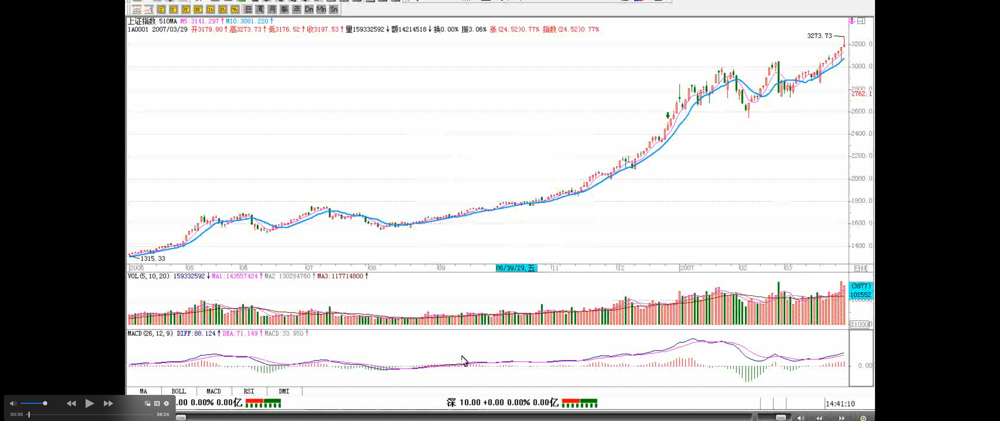

> 前面一些最基本的概念、原理、定理列举

首先把前面一些最基本的概念、原理、定理列举如下：

**走势：** 打开走势图看到的就是走势。走势分不同级别。

**走势类型：** 上涨、下跌、盘整（注释：向上盘整/向下盘整）。

**趋势：** 上涨、下跌。

> 走势中枢(v2.0)
>
> 中枢的区间：高中低，低中高

**缠中说禅走势中枢：** 某级别走势类型中，被至少三个连续次级别（疑问🤔️：一定是次级别吗？次级别以下的级别可以吗？）走势类型所重叠的部分。具体的计算**以前三个连续次级别的重叠为准**，严格的公式可以这样表示：次级别的连 续三个走势类型 A、B、C，分别的高、低点是 a1\a2,b1\b2,c1\c2。则，**中枢的区间**就是（max（a2,b2,c2），min（a1,b1,c1））而实际上用目测就可以，不用这么复杂。注意，次级别的前三个走势类型都是完成的才构成该级别的缠中说禅走势中枢，完成的走势类型，在次级别图上是很明显的，根本就不用着再看次级别下面级别的图了。

**缠中说禅盘整：** 在任何级别的任何走势中，某完成的走势类型只包含一个缠中说禅走势中枢，就称为该级别的缠中说禅盘整。

> 趋势（趋势中的走势中枢之间必须绝对不存在重叠）

**缠中说禅趋势：** 在任何级别的任何走势中，某完成的走势类型至少包含两个以上依次同向的缠中说禅走势中枢，就称为该级别的缠中说禅趋势。该方向向上就称为**上涨**，向下就称为**下跌**。**注意，趋势中的缠中说禅走势中枢之间必须绝对不存在重叠。**

“**缠中说禅技术分析基本原理一**”：任何级别的任何走势类型终要完成。

“**缠中说禅技术分析基本原理二**”：任何级别任何完成的走势类型，必然包含一个以上（注解：至少一个）的缠中说禅走势中枢。

“**缠中说禅走势分解定理一**”：任何级别的任何走势，都可以分解成同级别“盘整”、“下跌”与“上涨”三种走势类型的连接。

“**缠中说禅走势分解定理二**“：任何级别的任何走势类型，都至少由三段以上次级别走势类型构成。
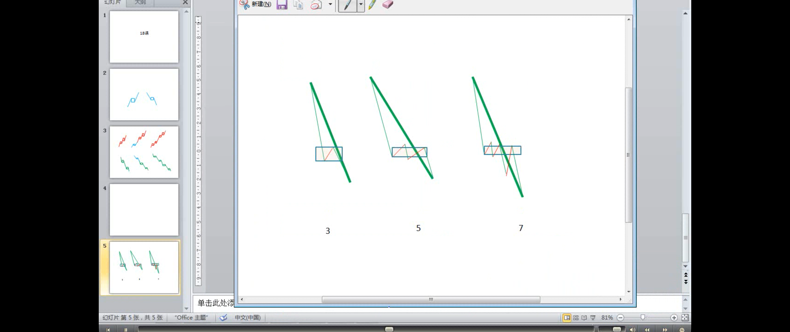
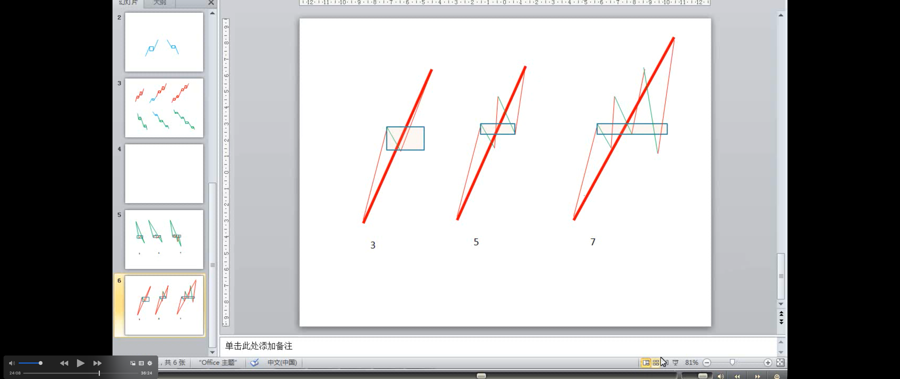

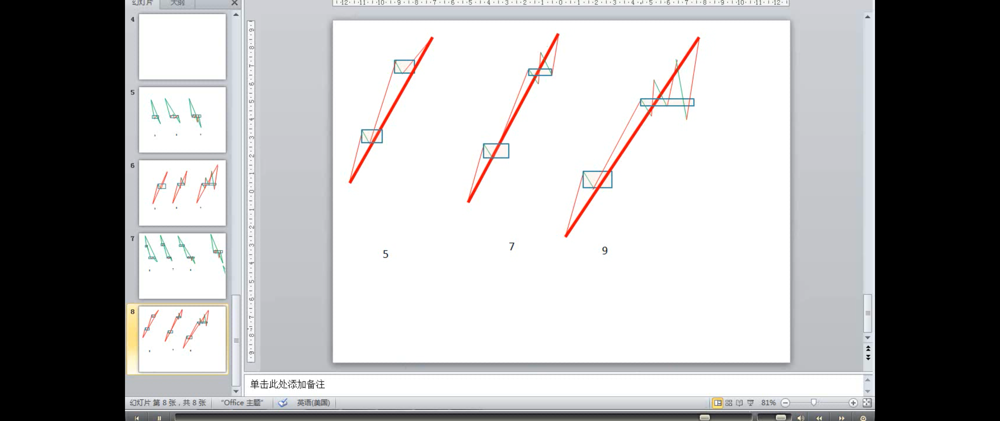

> 基本原理一的重要性（注解：一二类买卖点都基于基本原理一）

原理一“任何级别的任何走势类型终要完成”，这最简单的话，**却包含着技术分析最基本的东西，其哲学和灵魂都在此**，否则就不可能被列为原理一了，这是最重要的。

> 技术分析里最核心的问题之一：如何判断一个走势类型完成了？

**一个最简单的问题，如何判断一个走势类型完成了？这是技术分析里最核心的问题之一**，例如，一旦判断知道了 “下跌”的结束，就知道随后必须要面对的是“盘整”与“上涨”，而后两种走势，对于多头来说，都必然产生利润，唯一区别，就是大小与快慢的问题。如果在市场中能找到一种百分百确定的赢利模式，那就是最伟大的成就了，至于大小、快慢，可以继续研究出新的标准来进行判断，而在逻辑上，这是后话了。

> 判断走势类型完成的唯一难点，是走势类型的延伸
>
> 走势类型的延伸
>
> 盘整的延伸（注解：围绕中枢上上下下地延伸）

**这里最大的也是唯一的难点在于“走势类型的延伸”**。例如一个盘整，三个重叠的连续次级别走势类型后，盘整就可以随时完成，也就是说，_只要三个重叠的连续次级别走势类型走出来后，盘整随时结束都是完美的，但这可以不结束，可以不断延伸下去，**不断围绕这缠中说禅中枢上上下下地延伸**下去直到无穷都是可以的_。这有点像一个雏男在某种标准达到后就具有立刻成为面首的条件，随时可以被面首，但却也可以一直坚持下去，一直自我封闭，一直不让消费，最后把自己给浪费掉了，直到最后变成一个烂苹果。

> 趋势的延伸
>
> - 上涨的延伸：抓不住牛股
>
> - 下跌的延伸：抄底者的噩梦

**同样，面对趋势，形成两个依次同向的缠中说禅走势中枢后，任何趋势都可以随时结束而完美，但也可以不断地延伸下去，形成更多的中枢**。这种情况在实际操作中太常见了，如果这趋势是向上的，会不断上涨，看看 600519 之类的图，如果把复权算上，就可以看到一个标准的不断延伸的上涨。大盘 2005 年见底后的 30 分钟图上，同样可以看到这种情况。**很多人抓不住牛股，经常在第一个中枢时就被震下马，最主要就是对此没有明确的认识。反之，对于下跌的延伸，是所有抄底者的噩梦**。**逃顶、抄底为何难？归根结底就是这“走势类型的延伸”闹的。**
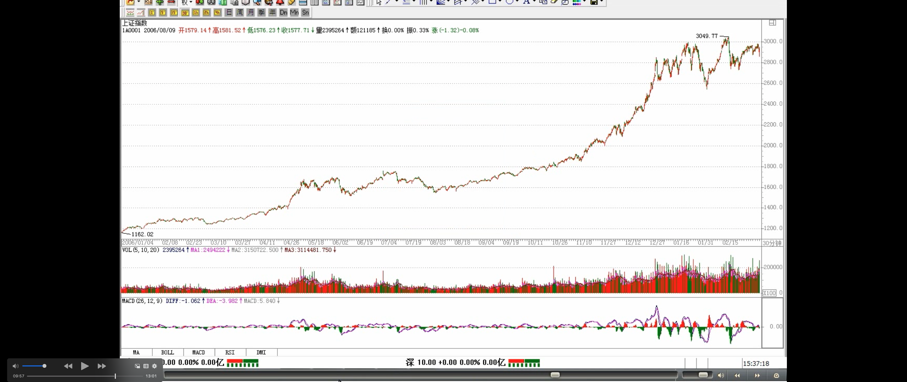
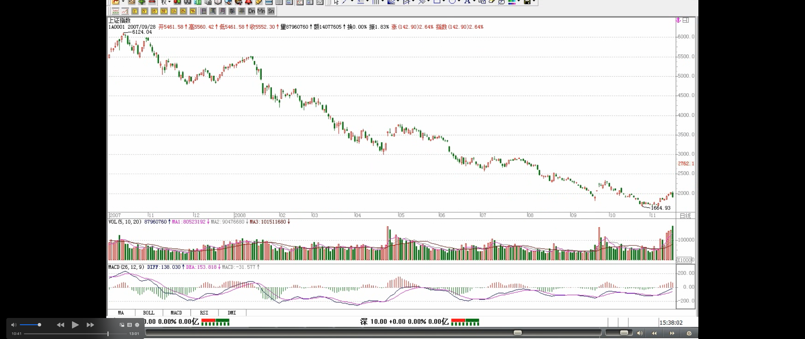

> 如何判别“走势类型延伸”是否结束
>
> - “走势类型延伸”是否结束的判断关键
>
> “走势类型延伸”的实质
>
> - 趋势延伸的实质：同级别的同向的中枢不断产生
> - 盘整延伸的实质：不能产生新的中枢
>
> “走势类型延伸”是否结束的判别关键：是否产生新的中枢
>
> 趋势与盘整的判别关键：是否产生新的中枢
>
> 中枢是技术分析中的核心（注解：中枢-->走势类型-->一类买卖点-->二类买卖点）

**如何判别“走势类型延伸”是否结束？** 这里，**必须首先搞清楚，“走势类型延伸”的实质是什么？** **对于趋势来说**，其“延伸”就在于同级别的同向“缠中说禅走势中枢”不断产生；**而对于盘整来说**，其“延伸”就在于不能产生新的“缠中说禅走势中枢”。由于“走势类型延伸”意味着当下的“走势类型”随时可以完成，因此相应的“类型”必然是确定的，**因此“走势类型延伸”是否结束的判断关键**就在于是否产生新的“缠中说禅走势中枢”。此外，由于趋势至少包含两个“缠中说禅走势中枢”，而盘整之有一个，因此**趋势与盘整的判别关键**也就在于是否产生新的“缠中说禅走势中枢”。**由此可见，“缠中说禅走势中枢”的问题是技术分析中的核心问题，该问题一旦解决，很多判断上的大难题也将引刃而解。**

> 中枢定理一（注解：**趋势中的两个中枢的连接段**必然是次级别或次级别以下级别的走势类型，次级别走势类型--本级别的线段，次次级别走势类型--次级别的线段--本级别的笔）

**“缠中说禅走势中枢定理一”：** 在趋势中（疑问：一定是趋势中吗？下面回答上一章的答案，也没有说是趋势中），连接两个同级别“缠中说禅走势中枢”的必然是次级别（注解：或次级别）以下级别的走势类型。

> 中枢定理一的证明
>
> 相连（连接段）走势类型的级别越低，表示其力度越大（次级别走势类型<次次级别走势类型<...<跳空缺口）

用反证法，**该定理的证明是很简单的**，而这也回答了上一章中的作业一“连接两相邻同级别缠中说禅走势中枢的一定是趋势吗？一定是次级别的趋势吗？”
**首先**，这不必然是趋势，任何走势类型都可能，**最极端的就是跳空缺口**后形成新的“缠中说禅走势中枢”；**其次**，也不一定是次级别的，只要是次级别以下，例如跳空缺口，就属于最低级别，如果图上是日线、周线，就不会是次级别了；**最后，往往相连走势类型的级别越低，表示其力度越大**，这也就是为什么缺口在分析中有比较强技术含义的理论依据所在。
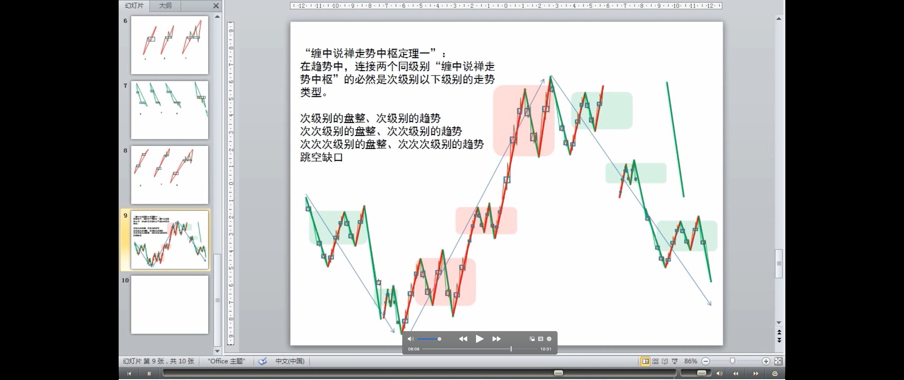

> 中枢的生（产生）、住（维持）、坏（破坏）、灭（废弃）
>
> 维持中枢的一个充分必要条件（住）
>
> [充分必要条件-wikipedia](https://zh.wikipedia.org/wiki/%E5%85%85%E5%88%86%E5%BF%85%E8%A6%81%E6%9D%A1%E4%BB%B6)
>
> 形成新中枢的条件（生）

由定义知道，“缠中说禅走势中枢”的产生原因以及判断标准，也就是其“生”问题已经解决，那余下的就是其“住、坏、灭”的问题。也就是说，一个“缠中说禅走势中枢”是如何“维持”以及最终被“破坏”进而废弃的。先考虑其“维持”的问题。**维持“缠中说禅走势中枢”的一个充分必要条件**就是任何一个离开该中枢的走势类型都必须是次级别以下的并以次级别以下的走势类型返回，该问题很容易证明，因为无论是离开还是返回，只要是同级别的走势类型，就意味着**形成新的“缠中说禅走势中枢”**，这与原中枢的维持前提矛盾。该命题表述成如下定理：

> 中枢定理二（维持中枢的充分必要条件）
>
> 关系：中枢维持（中枢延伸）& 中枢定理二

**“缠中说禅走势中枢定理二”：** 在盘整中，无论是离开还是返回“缠中说禅走势中枢”的走势类型必然是次级别(或次级别)以下的（走势类型）。

> 上一章作业三“盘整的高低点是如何造成的”

由此，**上一章作业三“盘整的高低点是如何造成的”** 就有了相应的答案：无论离开与返回的走势类型是何种级别的，在站最低级别上看，例如把 1 分钟图当成最低级别，那么最后连接离开与返回走势类型 **连接处的最低级别图，只能有两种可能：** 一、三根以上 1 分钟 K 线的来回重叠震荡后回头；二、1 分钟 K 线无三根以上 K 线重叠的 V 型走势。对于第一种情况，这几根重叠 K 线最极端那根的极端位置，就构成盘整中的高低点，一般来说，这种情况比较少见；对于第二种情况，这个 V 型尖顶那根 K 线的极端位置就构成盘整中的高低点，这种情况十分常见(疑问：这里貌似与实际情况相反)。这也是为何真正的低点和高点总是盘中一闪而过的理论依据。本 ID 的理论能解释技术图表上任何细致的问题，这才是一种真正理论所应该具有的品质。这种的理论，不需要什么诺贝尔的奖励，那一百万美圆在市场上算得了什么？精通这样的理论，市场会给予你多得多的回报。
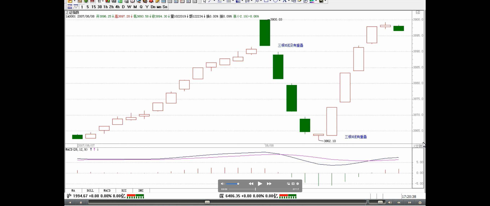

> 中枢定理三：中枢的破坏(坏)
>
> 定理三中的两个次级别走势的组合只有三种
>
> 最用力的破坏：趋势+盘整，特别这种突破是在底部区间

有了上面两个“缠中说禅走势中枢”定理，不难证明**定理三：** 某级别“缠中说禅走势中枢”的破坏，当且仅当一个次级别走势离开该“缠中说禅走势中枢”后，其后的次级别回抽走势不重新回到该“缠中说禅走势中枢”内（疑问：中枢区间内？）。
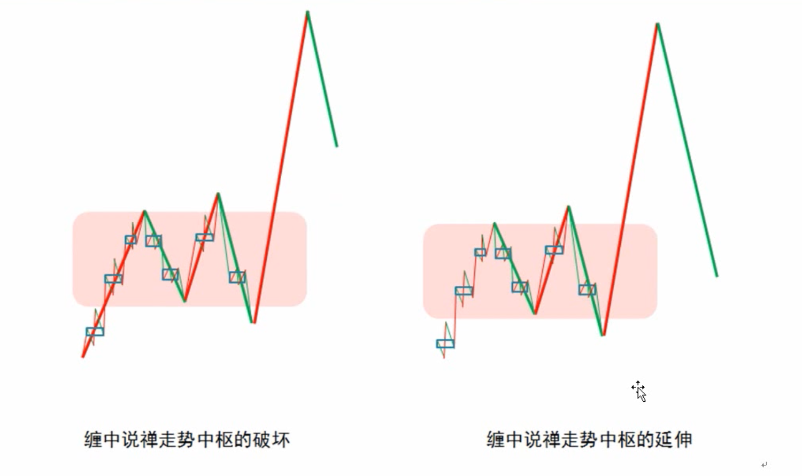

> 疑问：只有三种，没有盘整+反向盘整？

**这定理三中的两个次级别走势的组合只有三种：** 趋势+盘整，趋势+反趋势，盘整+反趋势。其中的趋势分为上涨与下跌，分别代表从上方突破与下方跌破两种情况。而站在实用的角度，**最用力的破坏，就是：** 趋势+盘整。**例如在上涨中**，如果一个次级别走势向上突破后以一个盘整走势进行整理回抽，那其后的上涨往往比较有力，**特别这种突破是在底部区间**。这种情况太常见了，其理论依据就在这里。

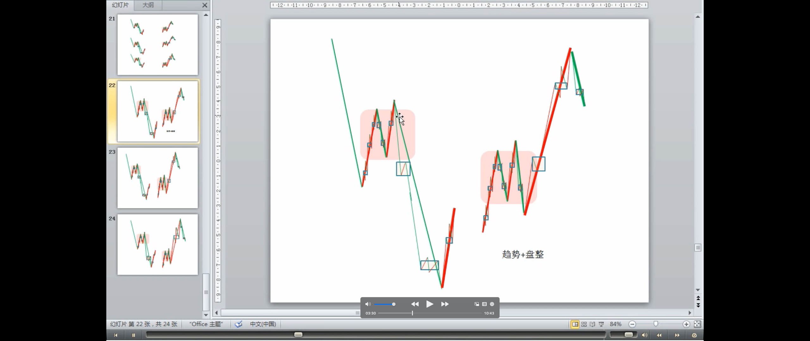

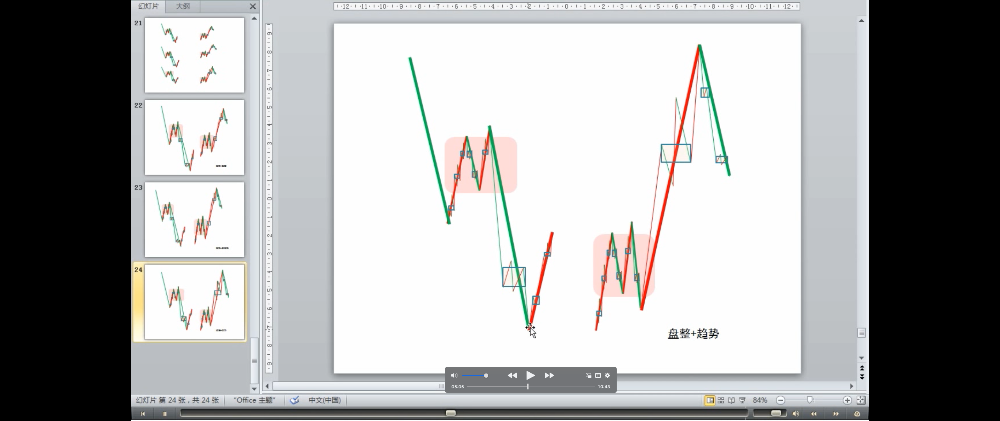

