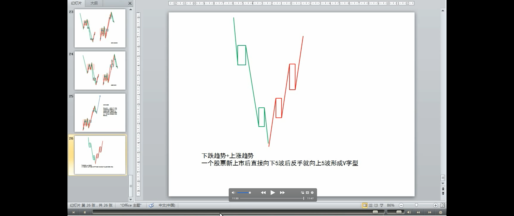
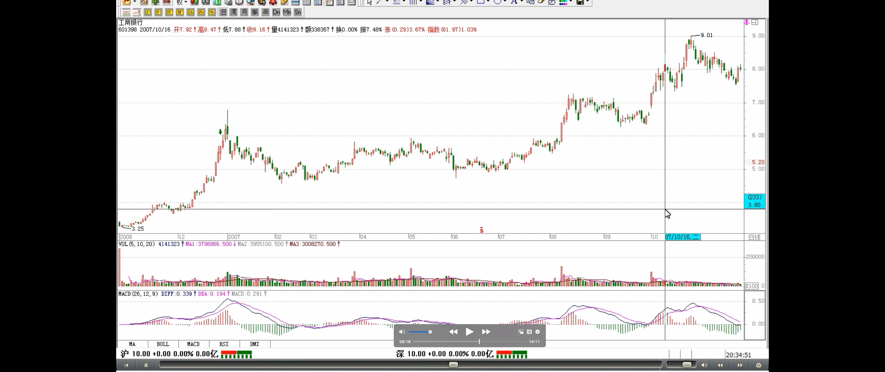
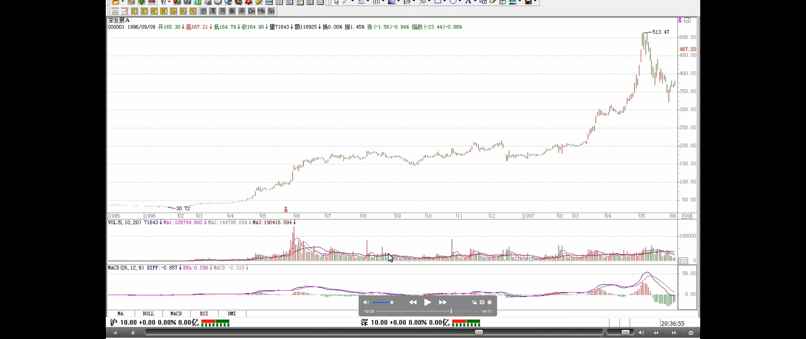

# 教你炒股票 19：学习缠中说禅技术分析理论的关键

**本 ID 看了看各位的问题，发现前面说了那么多，似乎真能看明白的没几个。** 为什么？很简单，估计来这里的人都没受过太严格的数学训练，如果受过严格的数学训练，本 ID 现在所说的，简直就是最简单不过的东西。**这里的整个推导过程，和几何里的毫无区别，初中学过几何的，都应该能明白。所以要看明白，最好先把自己的数学神经先活动起来。** 有一句不大中听的话，像孔男人之类的文科生，是很难炒什么股票的。别说一般的散户了，就算当庄家，本 ID 所见过的庄家肯定是全国最多的，有一个很明显的规律，就是文科生当庄家，基本死翘翘。这可不是玩笑话，是直接经验的总结。孔男人之类的文科生最大特点就是脑子缺根筋----数学思维的筋。

> 缠论与其他技术理论不同
>
> 其他技术理论，没有用，错漏百出

其次，请把以前学过的一切技术分析方法先放下，**因为本 ID 这里所说的，和所有曾有的技术分析方法的根本思路都不同**。一般的技术分析方法，或者用各种指标，或者用什么胡诌的波段、波浪，甚至江恩、神经网络等等，**其前提都是从一些神秘的先验前提出发**。例如波浪理论里的推动浪 5 波，调整浪三波之类的废话，**似是而非，实战中毫无用处，特别对于个股来说，更是没用**。至于什么江恩理论，还有什么周期理论、神经网络之类的，**都是把一些或然的东西当成必然，理论上头头是道，一用起来就错漏百出**。**那些支持位、阻力位，通道线、第三浪之类的玩意，只能当庄家制造骗线的好工具。**

> 缠论可以解释其他技术分析
>
> 庄家用技术图形来骗你，越经典的图形越能骗人。但任何庄家，唯一逃不掉的就是本 ID 在分析中所说的那些最基本的东西
>
> 只要是市场中的，必然在其中，庄家也不例外。就像任何的大救星，都逃不掉生老病死

**如果真明白了本 ID 的理论，就会发现，其他技术分析里所说的现象，都能在本 ID 的理论中得到解释，而且还可以给出其成立的相应界限**。例如，一个股票新上市后直接向下 5 波后反手就向上 5 波形成 V 字型，按波浪理论，就无法得到解释，而用缠中说禅走势中枢的定理，这是很容易解决的问题。那些理论都是把复杂的走势给标准化成某种固定的模式，就如同面首宣称不带套的爱不是爱一样可笑。**对于庄家来说，对一般人所认识的所谓技术分析理论，早就研究得比谁都精通，任何坐过庄的人都知道，技术图形是用来骗人的，越经典的图形越能骗人**。**但任何庄家，唯一逃不掉的就是本 ID 在分析中所说的那些最基本的东西**，因为这些东西本质上对于市场是“不患”的，**只要是市场中的，必然在其中，庄家也不例外。就像任何的大救星，都逃不掉生老病死。**

> 缠论技术分析只是三个独立的系统之一，三个独立系统背后的数学概率原则（基本面、比价系统、技术分析）（教你炒股票 9：甄别“早泄”男的数学原则！）
>
> 技术分析的重要性/意义/伟大之处
>
> - 单凭对技术分析的精通与资金管理的合理应用，就完全可以长期有效地战胜市场

**这里必要强调，技术分析系统在本 ID 的理论中只是三个独立的系统之一**，最基础的是三个独立系统所依据的概率原则所保证的数学上的系统有效性。 **但技术分析系统之所以重要，就是因为对于一个完全没有消息的散户来说，这是最公平、最容易得到的信息**，技术走势是完全公开的，对于任何人来说，都是第一手，最直接的，这里没有任何的秘密、先后可言。**技术分析的伟大之处就在于，利用这些最直接、最公开的资料，就可以得到一种可靠的操作依据。单凭对技术分析的精通与资金管理的合理应用，就完全可以长期有效地战胜市场**。对于一般的投资者来说，如果你希望切实参与市场之中，这是一个最稳靠的基础。

> 市场不单单是为挣钱而存在的，市场是一个最好的修炼自己的地方。战胜市场，其实就是战胜自己的贪婪、恐惧、愚蠢（注解：恐惧、贪婪来自未知，未知即无知，恐惧源于无知）
>
> 技术分析的最终意义：不是去预测市场要干什么，而是市场正在干什么，是一种当下的直观。在市场上所有的错误都是离开了这当下的直观，用想象、用情绪来代替
>
> 多次反复强调，牛市第一波涨的就是成分股

本 ID 觉得，如果你光只是想挣点钱，那么没必要学什么技术分析，在牛市里，买基金就可以了，特别是和指数相关的基金，你就至少能跟上指数的涨幅。**但市场不单单是为挣钱而存在的，市场是一个最好的修炼自己的地方，人类的贪婪、恐惧、愚蠢，哪里最多？资本市场里，每时每刻都在演绎着。在这个大染缸里修炼自己，这才是市场最大的益处**。**战胜市场，其实就是战胜自己的贪婪、恐惧、愚蠢（注解：恐惧来自未知，未知即无知，恐惧源于无知）**，**本 ID 的理论只是把市场拔光给各位看**，而拔光一个人并不意味着就等于征服一个人，对于市场，其道理是一样的。不干，不可能征服市场。对于市场来说，干就是一切。**技术分析的最终意义**不是去预测市场要干什么，而是市场正在干什么，是一种当下的直观。**在市场上所有的错误都是离开了这当下的直观，用想象、用情绪来代替**。例如现在，还有多少人为工行的上涨而忿忿不平，却不能接受这样一个当下最直观的事实。**多次反复强调，牛市第一波涨的就是成分股**，工行这最大的成分股不涨，还有谁涨？96 年的牛市，最大的成分股就是发展，那时候比这不更厉害多了，工行这又算得了什么？

> **_市场的规律_**是一种**_动态的_**，在 **_不同级别合力_** 作用下显示出来的规律
>
> 但只要把这动态的规律在当下的直观中把握好、应用纯熟，踏准市场的节奏，并不是不可能的

**市场是有规律的，但市场的规律并不是显而易见的，是需要严格的分析才能得到。更重要的是，市场的规律是一种动态的，在不同级别合力作用下显示出来的规律**，企图用些单纯的指标、波段、波浪、分型、周期等等预测、把握，只可能错陋百出。**但只要把这动态的规律在当下的直观中把握好、应用纯熟，踏准市场的节奏，并不是不可能的。**

最后布置一个作业：在所谓的波浪理论里，有一个所谓的结论，大概意思是说第四浪的调整一般在第三浪的第四子浪范围内，用缠中说禅走势中枢的相关定理分析该结论成立的范围以及局限性，相应给出类似走势的一个更合理的理论分析与实际操作准则。

# 回复

> 本 ID 对预测走势没有兴趣。本 ID 唯一会干的事情就是**等卖出信号的发出**。

---

600832 的 30 分钟中枢是不是与 5 分钟的走势重叠后，再看 5 分钟的前三段，那么中 枢区间应该是 11.40---11.13 之间，这样理解对吗?30 分钟里我指的是 12.11 日到
12 月 19 日的区间。

===

**走势只有一个**，走势图可以有很多，按 30 分钟看就是 30 分钟图， 按日线看就是日线图，但走势只有一个，由不断的交易构成。重叠的只 能是前后不同的走势，30 分钟和 5 分钟不存在重叠的问题。 你能说 5 分钟图上某三段走势发生重叠，但你不能说 5 分钟的和 30 分钟的重叠。

---

缠 JJ 好!在一张走势图(如日 K 线走势图)里,走势也有不同级别是吗?

===

这个理解是对的，但要精细点。
走势是分级别的，但在某张，例如 30 分钟的走势图上，日线级别 可以就显示出 30 分钟走势的连接，而 1 分钟级别的一些东西，在 30 分钟 图上就看不出来了。
**看越大级别的图，其实就是把低级别的一些信息给过滤了**。【韶山映 山红】这种过滤效应使得我们无从辨别是否具备足够的低级别走势的递归。】

---

博主，有疑问，请指教:日线图上，日 K 线单体所形成的曲线，是日线级别的次 级别走势吗，也就是用日 K 线曲线形成的中枢来判断日线级别的走势?【韶山映山 红】此人所说的可能是分时走势图。】对于级别总是感觉比较难把握，可能是我图看 太少的缘故吧，没图感。还有对于一个走势的终结，是不是按照是否产生新的同 方向上的中枢来判断的?那是否就是说一个走势的端部存在着一个中枢?而其实 一个走势的起止并不一定是通过价格来划定的，而一定可以通过中枢来划定，是 不是这样?

===

日线的几根 K 线不可能形成什么日线中枢，日线中枢只能到 30 分钟
图上出现三段完成的有重叠的走势类型中找。形成一个日线中枢，怎么
都至少需要 10 来根日 K 线。【韶山映山红】**很多人说缠论早期的中枢是笔中枢。一 个笔中枢的三段确实需要 13 根以上的 K 线。但是笔是有严格的定义和判断的。下图是缠师提
出中枢概念之后钦点的 580991 海尔 JTP1 权证的中枢案例，以日线笔中枢的角度看，第一笔就 不符合要求，就连新笔要求都不够。可见缠论早期的中枢顶多是接近笔中枢，而不能就说 是**。】

---

怎么可能是连续三个下跌?下跌+下跌还是 下跌，只能算一个走势 类型。
**中枢停留的级别越小，趋势的力度越大**，【韶山映山红】什么是“中枢停 留的级别”?就是中枢所在的走势完美的时候中枢所在的级别。中枢的级别就是趋势的级 别。】
禅说中缠
缺口不等于中枢，只是连接中枢的最低级别。**缺口表明离开原来中枢的力量比较大，但如果缺口以后出现一个很大级别的中枢，这就证明其力度有限了（注解：中枢在表达什么？趋势的反向力量导致的，多空在博弈）**。【韶山映山红】停留的级别很大的中枢，意味着当下哪个方向的力度都 很小。但这只是当下的判断，不能预测未来。】
**最强的当然就是缺口后一个 5 分钟甚至更短的中枢后就继续趋势，这 是最强的。例如，连续直接封涨停是最强的。为什么?因为缺口后的中
枢都是 1 分钟，最低级别的**。【韶山映山红】换句话说，如果这种连续一字板走势 之后的中枢级别很大，意味着将有长期大幅度的调整?还是长时间将无力上攻?以后研 究。】
**本 ID 理论可以解释各种现象，各位自己也可以开动脑筋，明白了， 很多现象都可以自己去解释，这样才能对理论有更深的认识。**

---

【韶山映山红】前面的分析正确，后面的分析更实 用。意思是说，**中枢和走势的划分虽然有正确与否，但没有标准答案，可以根据需要去选 择**。】

---

回升、或上涨中的中枢从回落的高点算起。下落或下跌形成的中枢 从回升的低点算起。
禅说中缠
禅说中缠
中枢有点像钟摆，回升的高点，就像把钟摆拉高，然后放手，去回 去三次确认。

---

LZ，刚才可能没说清楚，我的意思是，判断日线的走势中枢是否一定要看 30 分钟 图的相应走势。

===

一般都这样，但如果你熟练了，大概知道日线上那若干 K 线的组 合，在 30 分钟线上肯定会有三段以上的走势类型，也可以不看 30 分
钟。【韶山映山红】也就是说，不是简单地在日线上找笔中枢。要能够通过日 K 线组合推 测 30 分钟走势。那么，都有什么样的规律呢?★ 以后研究。如果老老实实做递归，就可以先 不去管这些。】

---

缠姐,上来晚了点不好意思,请问比如 000897 津滨发展这种典型的
应该怎么用您的理论来判断呢?它的卖点又应该在什么地方和情况下呢?请指 点密津.
的型角三升上
禅说中缠
禅说中缠
势走

====

临走回答一下，看次级别的图。
中枢形成后的走势不一定要超越中枢的范围，例如收敛三角形的走
势，就一定一直在中枢的范围内，这有点像空间的压缩，所以三角形的
突破都比较迅猛，但回抽与骗线也较多，在波浪理论中更把他当成第四
浪的主要形态，其理论的依据都在这里。【韶山映山红】收敛三角形的走势， 像空间的压缩，突破比较迅猛。骗线较多。】
**[中枢形成后形成压缩性走势]，意味着[多空力量的平衡与强硬]，即使 突破后，反方向的压力也回很大，很容易就构成最后一段的走势。但这最后的走势往往特别疯狂，在期货中更是这样**。【韶山映山红】中枢的形态。 可以做一个专题。以后研究。】

---

LZ,你好 走势类型是对走势的分类,还是构成走势的基本单位?

===

**如果把趋势当成 1，盘整当成 0，走势类型就如同 0、1，由此构成二进 位的各种数字。**

---
