# 教你炒股票 27： 盘整背驰与历史性底部

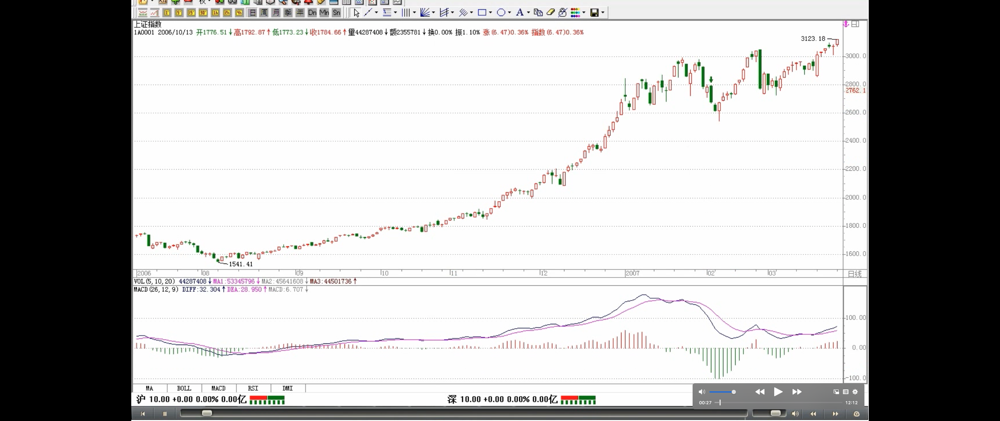

> 趋势背驰的一般情况
>
> - 至少是第二个中枢产生背驰
> - 绝大多数情况，第二个中枢就产生背驰
>   - 大级别，特别是日线以上级别（日线或者日线以上），90%以上
>   - 小级别，例如 1 分钟级别，比例小一点，但也是占大多数，一般 4、5 个中枢以后才出现背驰的，都相当罕见了

趋势，一定有至少两个同级别中枢，**对于背驰来说，肯定不会发生在第一个中枢之后，肯定是至少是第二个中枢之后**，对于那种延伸的趋势来说，很有可能在发生第 100 个中枢以后才背驰，当然，这种情况，一般来说，一百年见不到几次。**第二个中枢后就产生背驰的情况，一般占了绝大多数的情况，特别在日线以上的级别，这种就几乎达到 90%以上，因此，如果一个日线以上级别的第二个中枢，就要密切注意背驰的出现。而在小级别中，例如 1 分钟的情况下，这种比例要小一点，但也是占大多数。一般 4、5 个中枢以后才出现背驰的，都相当罕见了。**
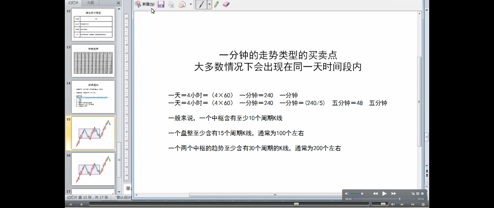

> 定义：盘整背驰
>
> - 技术含义
> - 小级别的盘整背驰
>   - 高位的盘整背驰，风险很大
>   - 低位的盘整背驰，会构成第二、三类买点
> - 背驰与买点的一般情况
>   - 第二、三类买点，由盘整背驰构成
>     - 盘整背驰产生第二、三类买点的走势情况
>   - 第一类买点，多数由趋势背驰构成
>
> 定义：背驰段

如果在第一个中枢就出现背驰，那不会是真正意义上的背驰，只能算是**盘整背驰**，其真正的**技术含义**，其实就是一个企图脱离中枢的运动，由于力度有限，被阻止而出现回到中枢里。一般来说，**小级别的盘整背驰**，意义都不太大，而且必须结合其位置，**如果是高位**，那风险就更大了，往往是刀口舔血的活动。**但如果是低位**，那意义就不同了，**因为多数的第二、三类买点，其实都是由盘整背驰（注解：次级别的）构成的，而第一类买点，多数由趋势的背驰（注解：本级别的？次级别的？）构成**。一般来说，**第二、三类的买点，都有一个三段的走势，第三段往往都破点第一段的极限位置，从而形成盘整背驰，注意，这里是把第一、三段看成两个走势类型之间的比较，这和趋势背驰里的情况有点不同（疑问：不同在哪里？），这两个走势类型是否一定是趋势，都问题不大，两个盘整在盘整背驰中也是可以比较力度的**。这里，先补充一个定义，就是在某级别的某类型走势，如果构成背驰或盘整背驰，就把这段走势类型称为**某级别的背驰段**。
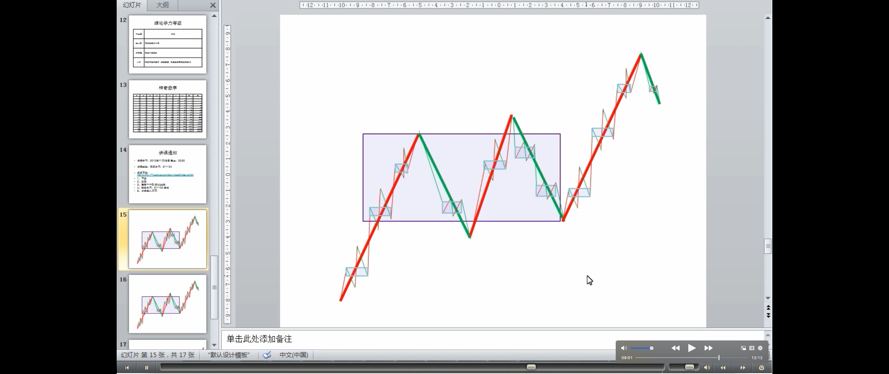

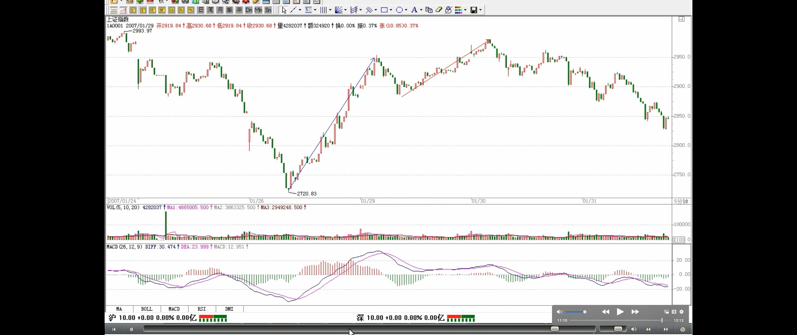

> 盘整背驰在大级别上的应用：发现历史性的大底部
>
> 例子
>
> - MACD 明显出现标准的背弛形态：一般来说，只要其中一个符合就可以是一个背弛的信号，两个都满足就更标准了
>
>   - 前提条件：第三段跌破第一段的 3.2 元。万科跌破 3.2 元就发出背弛的信号，季度线跌破 3.2 元后，这个背驰的成立已经是确认了
>   - 判断条件 1:回抽 0 轴的黄白线再次下跌不创新低
>   - 判断条件 2:而且柱子的面积是明显小于第 1 段的
>
> - 寻找精确的买点
>   - 精确的买点可以继续从月线、周线、日线、甚至 30 分钟一直找下去，如果你的技术过关，你甚至可以现场指出，就在这 1 分钟，万科见到历史性大底部。第三段的走势，从月线、周线、日线等，可以一直分析下去，找到最精确的背驰点。
>
> 疑问：例子中的第二段，为什么不是到前面的那个高点？

**盘整背驰最有用的，就是用在大级别上，特别是至少周线级别以上的，这种盘整背驰所发现的**，往往就是**历史性的大底部**。配合 MACD，这种背驰是很容易判断的。这种例子太多，例如 000002，谁都知道该股是大牛股，但这牛股的底部，如果学了本 ID 的理论，是谁都可以发现的。请看该股的季线图，也就是三个月当成一个 K 线的图。1993 年第一季度的 36。7 元下跌到 1996 年的第一季度的 3。2 元，构成第一段，刚好前后 13 季度，一个神奇数字；1996 年的第一季度然后到 2001 年第三季度的 15。99 元，**构成第二段，一个典型的三角形，中枢的第二段出现三角形的情况很常见（疑问：？）**，前后 23 季度，和 21 的神气数字相差不大；2001 年第三季度下跌到 2005 年的第三季度的 3。12 元，前后刚好 17 周，神奇数字 34 的一半，也是一个重要的数字。第一段跌幅是 33.5 元，第三段是 12.87 元，分别与神奇数字 34 和 13 极为接近。因为 13 的下一个神气数字是 21，加上前面说过的 17，都不可能是第三段的跌幅，因此，站在这种角度，万科的 2.99 元附近就是铁底了。不过这种数字分析意义不大，**最简单的判断还可以用 MACD 来，第三段跌破第一段的 3.2 元，但 MACD 明显出现标准的背弛形态：** 回抽 0 轴的黄白线再次下跌不创新低，而且柱子的面积是明显小于第 1 段的，**一般来说，只要其中一个符合就可以是一个背弛的信号，两个都满足就更标准了**。**从季度图就可以看出，万科跌破 3.2 元就发出背弛的信号**。而实际操作中，光看季度线是不可能找到精确的买点的，但对大资金，这已经足够了，因为大资金的建仓本来就是可以越跌越买，只要知道其后是一个季度级别的行情就可以了。**而对于小资金来说，这太浪费时间，因此精确的买点可以继续从月线、周线、日线、甚至 30 分钟一直找下去，如果你的技术过关，你甚至可以现场指出，就在这 1 分钟，万科见到历史性大底部**。**因为季度线跌破 3.2 元后，这个背驰的成立已经是确认了，而第三段的走势，从月线、周线、日线等，可以一直分析下去，找到最精确的背驰点。**

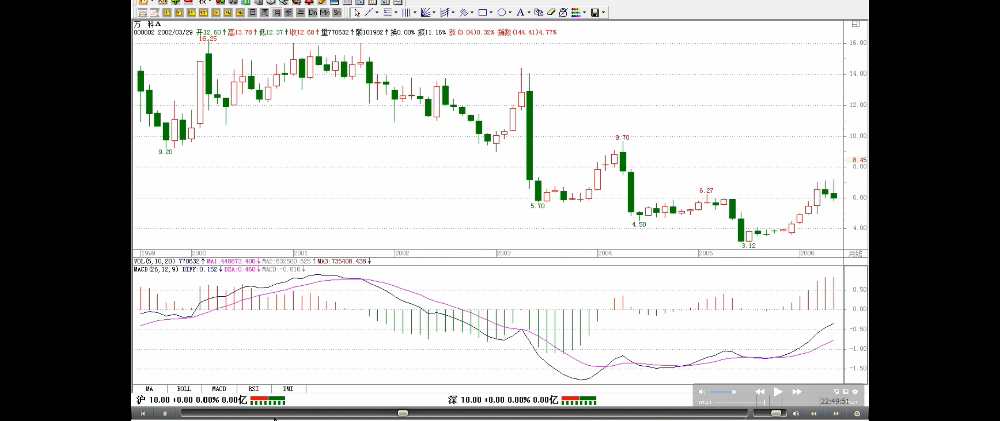

> 区间套：从大级别往下精确找大级别买点的方法
>
> - 具体方法

学过数学分析的，都应该对区间套定理有印象。**这种从大级别往下精确找大级别买点的方法，和区间套是一个道理**。以万科为例子，**季度图上的第三段，在月线上，可以找到针对月线最后中枢的背驰段，而这背驰段，一定在季度线的背驰段里，而且区间比之小，把这个过程从月线延伸到周线、日线、30 分钟、5 分钟、1 分钟，甚至是每笔成交，这区间不断缩小，在理论上，甚至可以达到这样一种情况，就是明确指出，就这一笔是万科历史底部的最后一笔成交**，这成交完成意味着万科一个历史性底部的形成与时代的开始。当然，这只是最理想的情况，因为这些级别不是无限下去的，因此，理论上并不能去证明就是一个如极限一样的点状情况的出现，但用这种方法去确认一个十分精确的历史底部区间，是不难的。

> 精确大转折点寻找程序定理

推而广之，可以证明**缠中说禅精确大转折点寻找程序定理**：某大级别的转折点，可以通过不同级别背驰段的逐级收缩范围而确定。换言之，某大级别的转折点，先找到其背驰段，然后在次级别图里，找出相应背驰段在次级别里的背驰段，将该过程反复进行下去，直到最低级别，相应的转折点就在该级别背驰段确定的范围内。如果这个最低级别是可以达到每笔成交的，理论上，大级别的转折点，可以精确到笔的背驰上，甚至就是唯一的一笔。（当本 ID 十几年前发现这个定理时，有一个坏毛病，总是希望在实际操作上也精确到笔，因此还发明了其他古怪的看盘方法，不过这些其实都意义不大，1 分钟的背驰段，一般就是以分钟计算的事情，对于大级别的转折点，已经足够精确了，对大资金，基本没什么用处。）

> 上一段的例子
>
> 区间套

要理解本章，如果忘了的，最好把高数里的区间套定理复习一下，这个思路是一样的，当然，由于级别不是无限可分的，不可能达到数学上唯一一点的精度。各位有时间可以参考一下，600640、000001、000006、000009、000012、600643 的季度图，看看历史底部是怎么形成的。当然，只有特别老的股票才可以用季度图。而月线图的，看 600663、一个标准的例子。

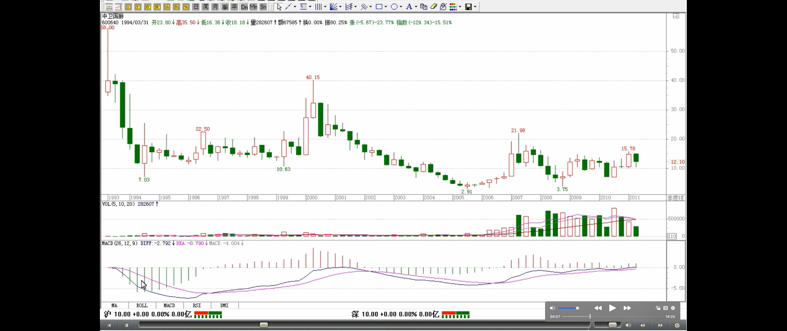
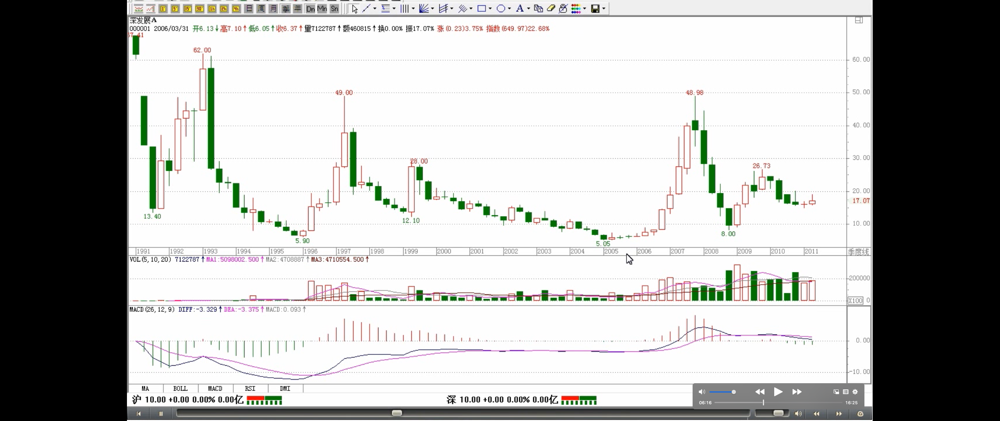

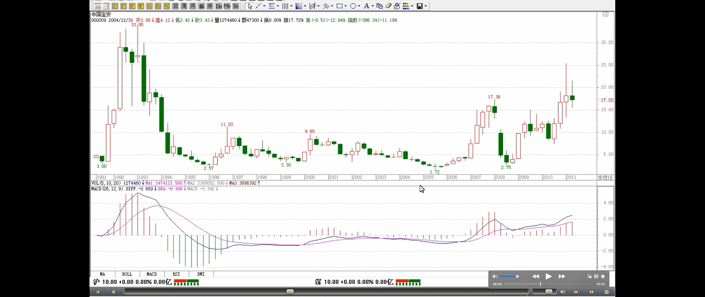
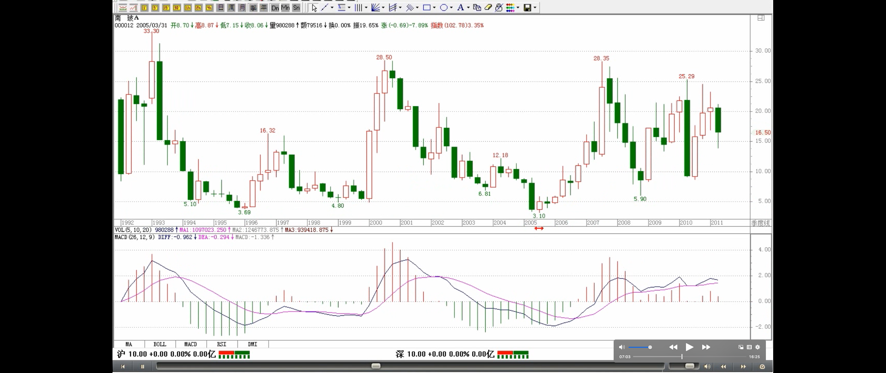
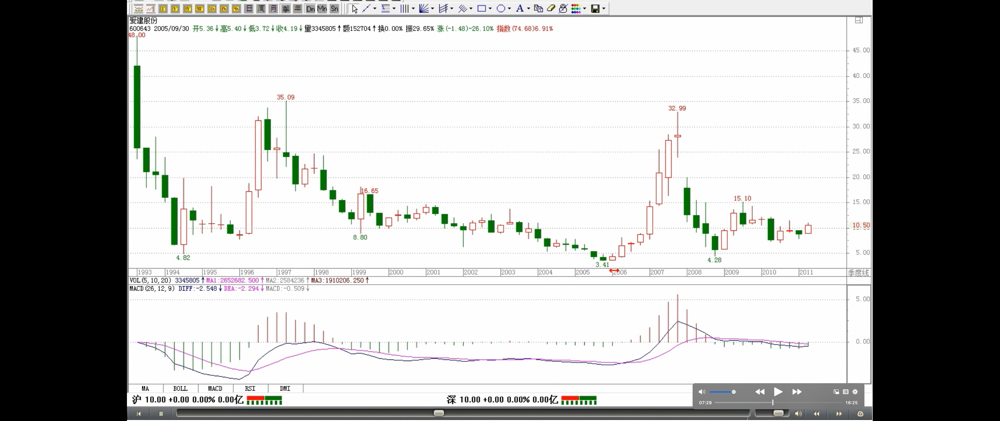
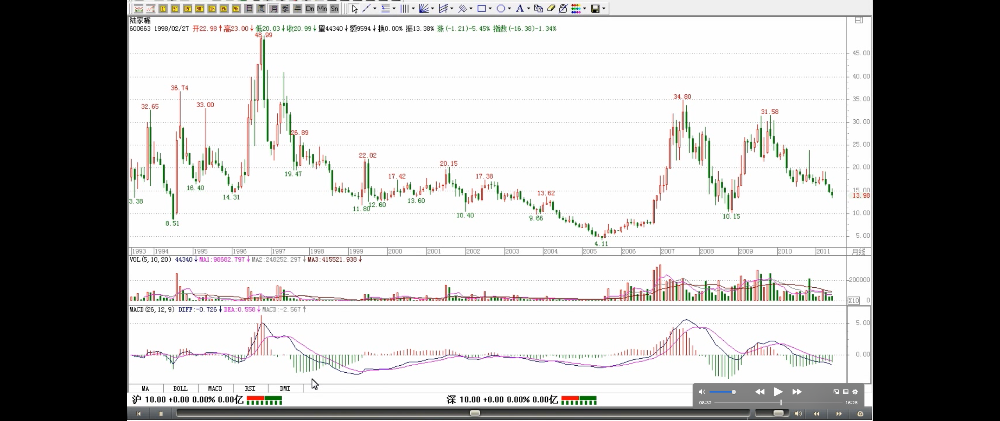

> 第一类买点：趋势背驰构成的
>
> 类第一类买点：大级别盘整背驰构成的类似第一类买点的买点
>
> 超大级别里，往往不会形成一个明显的趋势，只有一个中枢，是一个盘整

上面说的是背驰构成的买点，注意，**第一类买点肯定是趋势背驰构成的，而盘整背驰构成的买点，在小级别中是意义不大的，所以以前也没专门当成一种买点，但在大级别里，这也构成一种类似第一类买点的买点**，**因为在超大级别里，往往不会形成一个明显的趋势，这也就是以前回帖曾说过的，站在最大的级别看，所有股票都只有一个中枢，因此，站在大级别里，绝大多数的股票都其实是一个盘整**，这时候就要用到这因为盘整背驰而形成的**类第一类买点**了。这个级别，至少应该是周线以上。

> 类第二类买点

类似的，在大级别里，如果不出现新低，但可以构成**类似第二类买点的买点**，在 MACD 上，显示出类似背驰时的表现，黄白线回拉 0 轴上下，而后一柱子面积小于前一柱子的。一个最典型的例子，就是季度图上的 600685，2005 年的第三季度的 2.21 元构成一个典型的类第二类买点。在实际操作中，2.21 元的相应区间的寻找，也是按上面级别逐步往下找背驰段的方法实现。
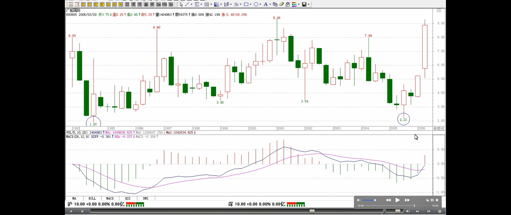

> 不过，周线找出来的，不一定是历史性大底，可能就是一个比较长线的底部
>
> 如果把这种方法用在日线上，也是可以的，但相应的可靠性就不是那么绝对了

这一课，把找大牛市底部的一个方法说了，这个方法足以让你终生受用。随着以后股票越来越多，老股票越来越多，这种方法将在下一轮大牛市中大放异彩，这大牛市搞不好是 30 年以后的事情了，30 年以后，希望你还能记得这一课。当然，如果按照周线级别，那不用等 30 年了。**不过，周线找出来的，不一定是历史性大底，可能就是一个比较长线的底部**。**如果把这种方法用在日线上，也是可以的，但相应的可靠性就不是那么绝对了。**

（待续）

补充一个本 ID 理论的学历标准

精通找出各级别中枢的，是幼儿圆毕业

精通分别中枢的新生、延伸、扩展的，是学前班毕业

精通分辨盘整背驰与背驰，躲过盘整背驰转化为第三类买卖点的是小学毕业

各位自己对照一下。
