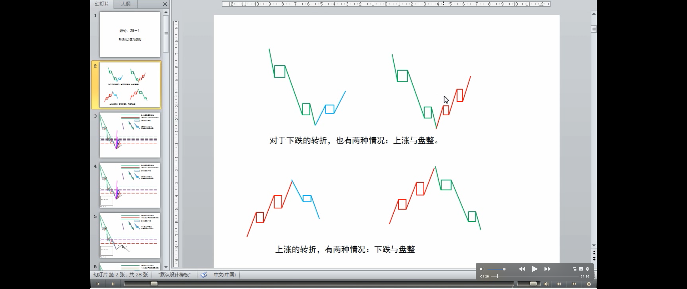
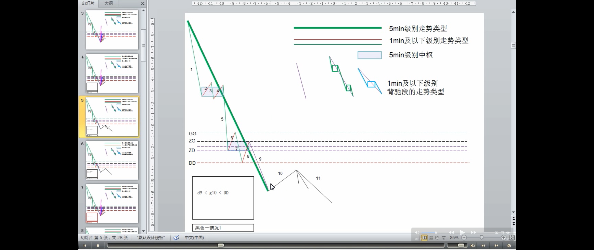
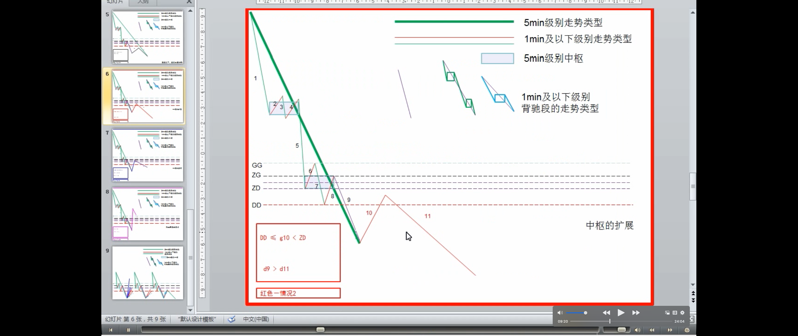
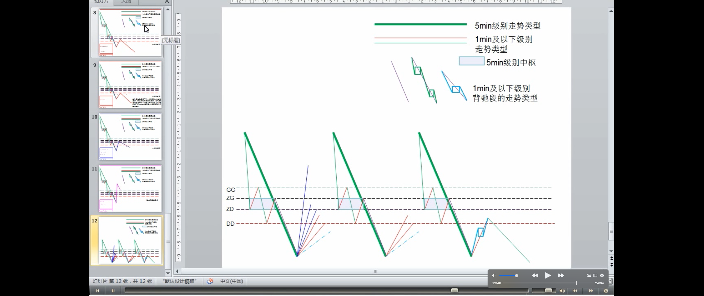
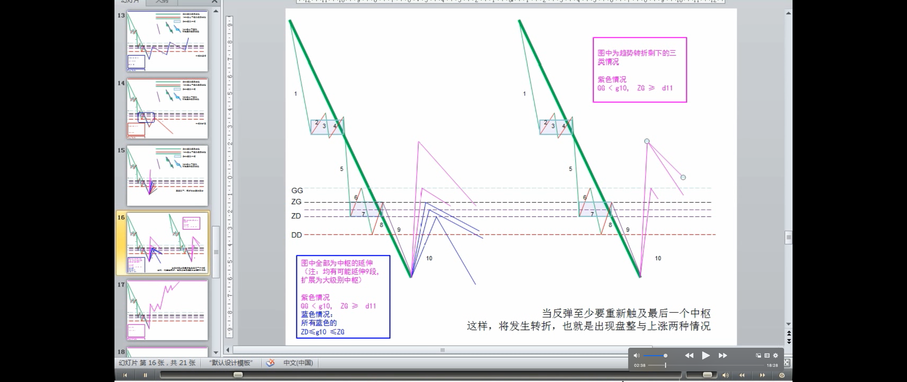
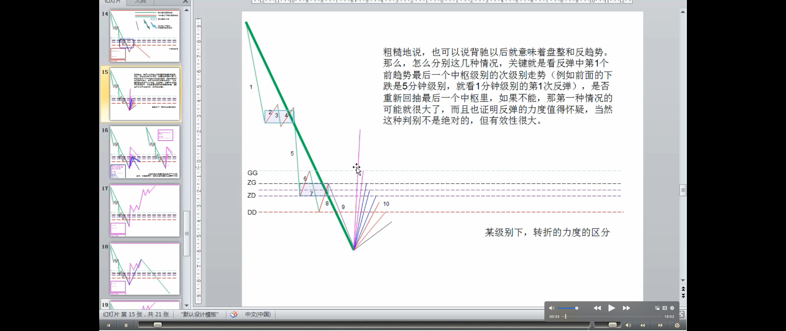
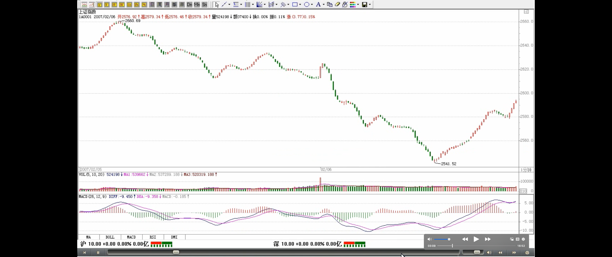
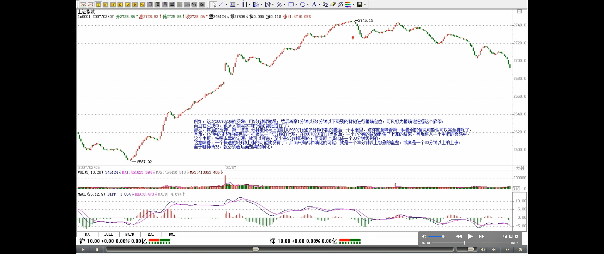
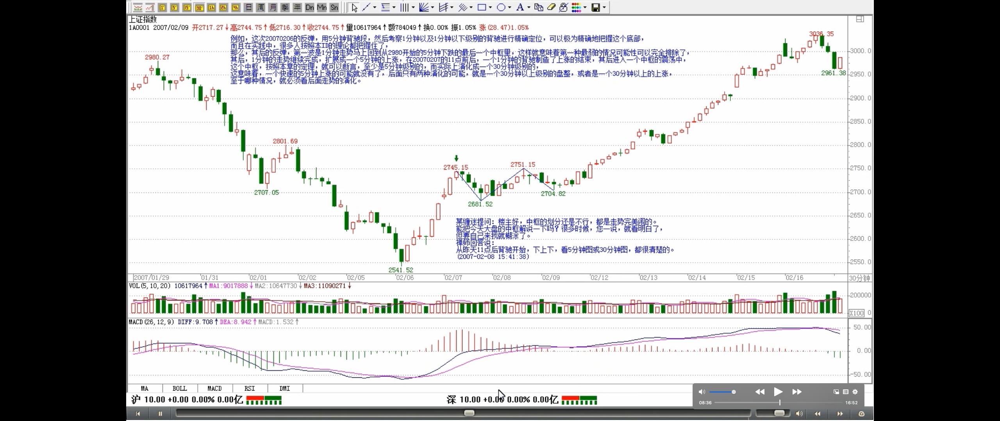

# 教你炒股票 29：转折的力度与级别

> - 定义：转折：趋势才有转折，盘整不存在转折问题
>   - 上涨的转折
>   - 下跌的转折

在某级别的盘整中，或者说围绕某级别中枢的震荡、延续中，不存在转折的问题，除非站在次级别图形中，才有转折问题的探讨。对于**上涨的转折**，有两种情况：下跌与盘整；对于**下跌的转折**，也有两种情况：上涨与盘整。

> 疑问：扩展=扩张=升级（即级别升级-前面课程）
>
> 转折是有级别的（注解：因为趋势是有级别的）

> 背驰与转折的关系
>
> - 背驰-转折定理
>
> 背驰-买卖点定理的关系

**转折是有级别的**，**关于转折与背驰的关系**，有如下定理：
**缠中说禅背驰-转折定理**：某级别趋势的背驰将导致该趋势最后一个中枢的级别扩展、该级别更大级别的盘整（疑问：比该级别更大？）或该级别以上级别的反趋势（疑问：该级别或以上级别？）。

> 用一个例子来说明背驰-转折定理
>
> 精确买卖点的寻找方法（区间套：27 课）
>
> 下跌背驰后的反弹的三种情况

该定理的证明有点抽象，估计大多数的人都没兴趣，**那就用一个例子来说明，也大致知道证明的轮廓，更重要的是，这样，各位对走势的形成有一个更深切的认识**。例如，**一个 5 分钟背驰段的下跌，最终通过 1 分钟以及 1 分钟以下级别的精确定位，最终可以找到背驰的精确点，其后就发生反弹**。注意，反弹只是一般的术语，在本 ID 的理论中，**对这反弹会有一个很明确的界定，就是包括三种情况：** 一、该趋势最后一个中枢的级别扩展、二、该级别更大级别的盘整、三该级别以上级别的反趋势。

一、该趋势最后一个中枢的级别扩展

> 该趋势最后一个中枢的级别扩展/扩张/升级，是背驰后力度最弱的反弹

对于 5 分钟级别趋势发生背驰的情况，那这个 5 分钟级别的趋势里所具有的中枢都是 5 分钟级别的，假设共有 N 个，显然，这个 N>=2。考虑最后一个中枢的情况，最后的背驰段，跌破该中枢后，该背驰段显然是一个 1 分钟以下级别的走势，否则就和该中枢是 5 分钟级别趋势的最后一个中枢的前提矛盾了。**该背驰段（注解：图中 9）出现（注解：次级别的-1 分钟）*第一类买点*发生反弹**，显然，该反弹一定触及最后一个中枢的 DD=min(dn)，也就是围绕该中枢震荡的最低点，否则，如果反弹连这都触及不了，就等于在下面又至少形成一个新的 5 分钟中枢，这与上中枢是最后一个矛盾。**这种只触及最后一个中枢的 DD=min(dn)的反弹（注解：大于等于 DD 且小于 ZD），就是背弛后最弱的反弹，这种反弹，将把最后一个中枢变成一个级别上的扩展，例如，把 5 分钟的中枢扩展成 30 分钟甚至更大的中枢。**

> 一般这种情况出现得特别少
>
> 遇到这种情况，找机会马上退出

前面说过，第一类买点是绝对安全的，即使是这样一种最低级别的反弹，也有足够的空间让买入获利，而且，**一般这种情况出现得特别少，很特殊的情况**，但理论上，是要完全精确的，不能放过任何一种情况，**如果不幸碰到这种情况，在资金利用率的要求下，当然是要找机会马上退出，否则就会浪费时间了。**

> 盘整背驰中转化成第三类卖点，与这种情况的不同
>
> 疑问：这里没懂有什么区别

注意，这种情况和盘整背驰中转化成第三类卖点的情况不同，**那种情况下反弹的级别一定比最后一个中枢低，而这种情况反弹的级别一定等于或大于最后一个中枢的**（疑问：不也是小于吗？）。因此，这两种情况，不难区分。

二、该级别更大级别的盘整、
三、该级别以上级别的反趋势。

> 当反弹触及最后一个中枢，就有两种情况出现：盘整或上涨（上涨的力度>盘整的）
>
> 盘整的中枢级别一定大于下跌中的中枢级别
>
> 上涨的中枢级别不一定大于下跌中的中枢级别（大于或等于）

这二种情况就是发生转折的两种情况，原理是一样的，只是相应的力度有区别。**当反弹至少要重新触及最后一个中枢**，这样，**将发生转折，也就是出现盘整与上涨两种情况**，对于上面 5 分钟下跌的例子，就意味着，将出现 5 分钟级别更大的盘整或 5 分钟级别以上的上涨，两段走势类型的连接，**就有两种情况出现：下跌+盘整，或者下跌+上涨**。**注意，这里的盘整的中枢级别一定大于下跌中的中枢级别（疑问：为什么盘整的一定大于下跌的级别？）**，否则就和下跌的延伸或第一种该趋势最后一个中枢的级别扩展搞混了。而上涨的中枢，不一定大于上(注解：下)跌中的中枢，**例如**，一个 5 分钟级别的下跌后反过来是一个 5 分钟级别的上涨，这是很正常的，但如果是盘整，那就至少是 30 分钟级别的。

> 举例说明：为什么“下跌+盘整”中盘整的中枢级别一定大于下跌中的中枢？（疑问：这里的说明，假设了盘整是 30 分钟级别的，所以这个说明逻辑有问题，没有讲明白为什么）
>
> 走势类型表达式：a+A+b+B+c
>
> 盘整的级别一定比下跌的级别大，最主要的原因（疑问：没明白）

**有人总是搞不明白为什么“下跌+盘整”中盘整的中枢级别一定大于下跌中的中枢，这里不妨用一个例子说明一下：** 例如，还是一个 5 分钟的下跌，那至少有两个中枢，整个下跌，最一般的情况就是 a+A+b+B+c，其中的 a\b\c，其级别最多就是 1 分钟级别的，甚至最极端的情况，可以就是一个缺口。**而 A、B，由于是 5 分钟级别的中枢，那至少由 3 段 1 分钟的走势类型构成**，如果都按 1 分钟级别的走势类型来计量，而且不妨假设 a\b\c 都是 1 分钟的走势类型，那么 a+A+b+B+c 就有 9 个 1 分钟的走势类型。
而一个 30 分钟的盘整，至少有 3 个 5 分钟的走势类型，而 1 个 5 分钟的走势类型，至少有 3 个 1 分钟的走势类型，**也就是一个 30 分钟的盘整，就至少有 9 个 1 分钟的走势类型，这和上面 a+A+b+B+c 的数量是一致的。从这数量平衡的角度，就知道为什么“下跌+盘整”中盘整的级别一定比下跌的级别大了**，如果级别一样，例如一个 5 分钟的盘整，只有 3 个 1 分钟的走势类型，那和 9 就差远了，也不匹配。当然，**“下跌+盘整”中盘整的级别一定比下跌的级别大，最主要的原因还不是这个**，而是上面说到的，如果该级别一样，那只有两种情况，下跌延伸或下跌最后一个中枢扩展，和“下跌+盘整”是不搭界的。

**有人可能还有疑问，如果下跌最后一个中枢扩展，例如 5 分钟扩展成 30 分钟，那和 5 分钟级别下跌+30 分钟级别盘整有什么区别？** 这区别大了，因为在“5 分钟级别下跌+30 分钟级别盘整”，也就是“下跌+盘整”中，**下跌和盘整都是完成的走势类型**，这意味着是两个走势类型的连接。而下跌最后一个中枢扩展，**是一个未完成的走势类型的延续**，还在一个走势类型里。例如，在上面的 a+A+b+B+c 里，如果 B+c 发生中枢扩展，从 5 分钟扩展成 30 分钟的，那么 a+A+b 就是一个 5 分钟的走势类型，把 a+A+b 用 a~表示，而 B+c 发生中枢扩展用 A~表示，那么整个走势就表示成 a~+ A~，其后的走势还可以继续演化，形成 a~+A~+b~+B~+c~，也就是扩展成一个 30 分钟级别的下跌，当然还可以有其他的演化，**总之，是必须把走势类型给完成了**，这和“下跌+盘整”的情况显然是不同的。

**本 ID 的理论是最市场走势最精确的分析，必须把所有情况以及其分辨了然于胸，才可能对市场的走势有一个精确的把握**。如果本 ID 把这套理论出版，书名就可以是《《市场哲学的数学原理》，因为本 ID 的理论的严密性以及对市场的意义，一点不比牛顿对物理的意义差，这一点，是必须逐步明确认识的。**而且，本 ID 这套理论，是建立在纯数学的推理上的**，完全没有发生爱因斯坦对牛顿颠覆等类似无聊事情的可能。不了解这一点，是不可能真正理解本 ID 理论的，因此就会“学如不及，犹恐失之”。

> 下跌趋势背驰后的/第一类买点后的三种完全分类走势、走势的级别、走势的力度
>
> 上涨趋势背驰后的/第一类卖点后的情况是一样的，只是方向相反
>
> 第一种情况很少发生且和第二种情况有所类似
>
> 怎么分别这三种情况
>
> - DD<=第一次次级别走势<ZD，走势力度弱，趋势的最后一个中枢升级可能性很大，当然这种判别不是绝对的，但有效性很大。
> - ZD<=第一次次级别走势，可能是第二或第三种情况

**以上三种情况，就完全分类了某级别背驰后的（注解：走势的）级别与力度，也就是某级别的第一类买点后将发生怎么样的情况，而第一类卖点的情况是一样的，只是方向相反**。注意，这里说的是最精确的情况，由于第一种情况很少发生且和第二种情况有所类似，所以粗糙地说，也可以说背驰以后就意味着盘整和反趋势。**那么，怎么分别这几种情况，关键就是看反弹中第 1 个前趋势最后一个中枢级别的次级别走势（例如前面的下跌是 5 分钟级别，就看 1 分钟级别的第 1 次反弹），是否重新回抽最后一个中枢里，如果不能，那第一种情况的可能就很大了，而且也证明反弹的力度值得怀疑，当然这种判别不是绝对的，但有效性很大。**

> 实例

例如，这次 20070206 的反弹，用 5 分钟背驰段，然后考察 1 分钟以及 1 分钟以下级别的背驰进行精确定位，可以极为精确地把握这个底部，而且在实践中，很多人按照本 ID 的理论都把握住了，那么，其后的反弹，第一波是 1 分钟走势马上回到从 2980 开始的 5 分钟下跌的最后一个中枢里，这样就意味着第一种最弱的情况可能性可以完全排除了，其后，1 分钟的走势继续完成，扩展成一个 5 分钟的上涨，在 20070207 的 11 点前后，一个 1 分钟的背驰制造了上涨的结束，其后进入一个中枢的震荡中，这个中枢，按照本章的定理，就可以断言，至少是 5 分钟级别的，而实际上演化成一个 30 分钟级别的，这意味着，一个快速的 5 分钟上涨的可能就没有了，后面只有两种演化的可能，就是一个 30 分钟以上级别的盘整，或者是一个 30 分钟以上的上涨，至于哪种情况，就必须看后面走势的演化。

> 操作中，是在第一、二类买点先买了，然后观察第三类买点是否出现，出现就继续持有，否则就可以抛出
>
> - 观察背驰段和一买
> - 观察一买后第一段的力度，至少回到最后一个中枢
> - 在第二类买点，买
> - 观察是否有三买，有，持有；没有，卖
>
> 当然，如果是资金量特别小，或者对本 ID 的理论达到小学毕业水平，那么完全可以在突破的次级别走势背驰时先出掉，然后看回试是否形成第三类买点，形成就回补，不形成就不回补，就这么简单
>
> 这种操作，必须反复看图、实际操作才可能精通、熟练的

**而对于实际的操作，这两种情况并没有多大的区别，例如是盘整还是上涨，关键看突破第一个中枢后是否形成第三类买点，而操作中，是在第一、二类买点先买了，然后观察第三类买点是否出现，出现就继续持有，否则就可以抛出，因此在操作上，不会造成任何困难。当然，如果是资金量特别小，或者对本 ID 的理论达到小学毕业水平，那么完全可以在突破的次级别走势背驰时先出掉，然后看回试是否形成第三类买点，形成就回补，不形成就不回补，就这么简单**。当然，要达到这种境界，首先要对本 ID 的理论小学毕业，否则，你根本分辨不清楚盘整背驰与第三类买点的转化关系，怎么可能操作？**而且，这种操作，必须反复看图、实际操作才可能精通、熟练的**。当然，如果真精通、熟练了，除了同样是本 ID 小学已经毕业的人，几乎没有人是你的对手了。

> 实际操作中，怎么才能达到效率最高

那么，**实际操作中，怎么才能达到效率最高**。**一个可被理论保证的方法就是：** 在第一次抄底时，最好就是买那些当下位置离最后一个中枢的 DD=min(dn)幅度最大的，所谓的超跌，应该以此为标准。**因为本章的定理保证了，反弹一定达到 DD=min(dn)之上，然后在反弹的第 1 波次级别背驰后出掉，如果这个位置还不能达到最后一个中枢，那么这个股票可以基本不考虑，当然，这可能有例外，但可能性很小**。然后在反弹的第一次次级别回试后买入那些反弹能达到最后一个中枢的股票而且最好是突破该中枢的而且回试后能站稳的，根据走势必完美，一定还有一个次级别的向上走势类型，如果这走势类型出现盘整背驰，那就要出掉，如果不出现，那就要恭喜你了，你买到了一个所谓 V 型反转的股票，其后的力度当然不会小。至于如何预先判断 V 型反转，这就不是本章定理可以解决的问题，必须在以后的课程里才能解决。

