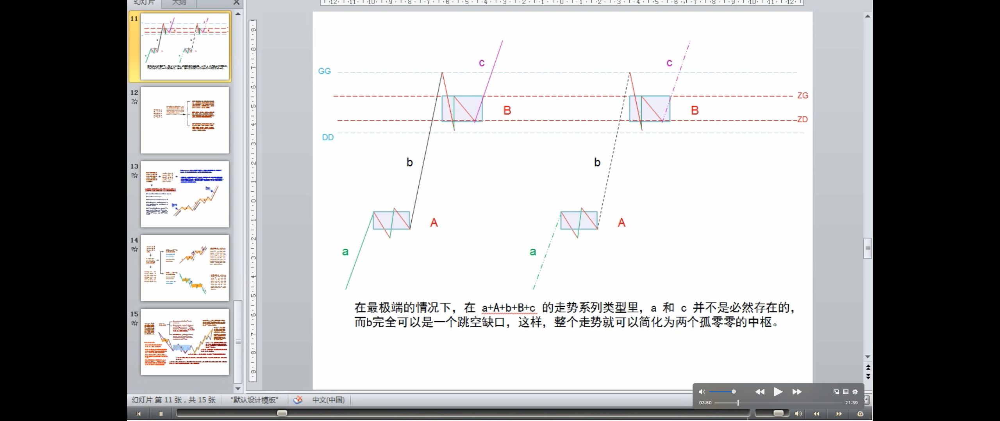
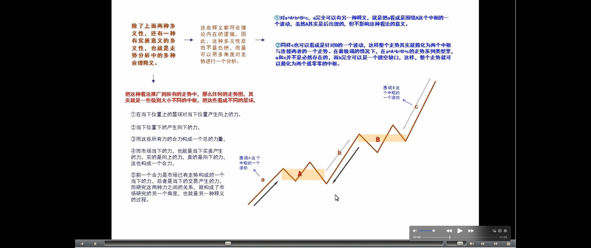
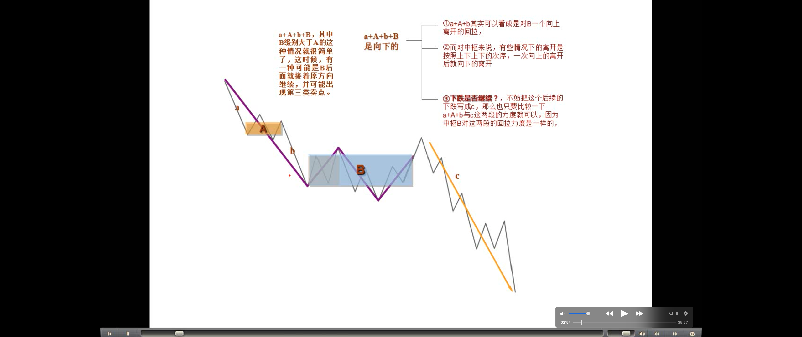
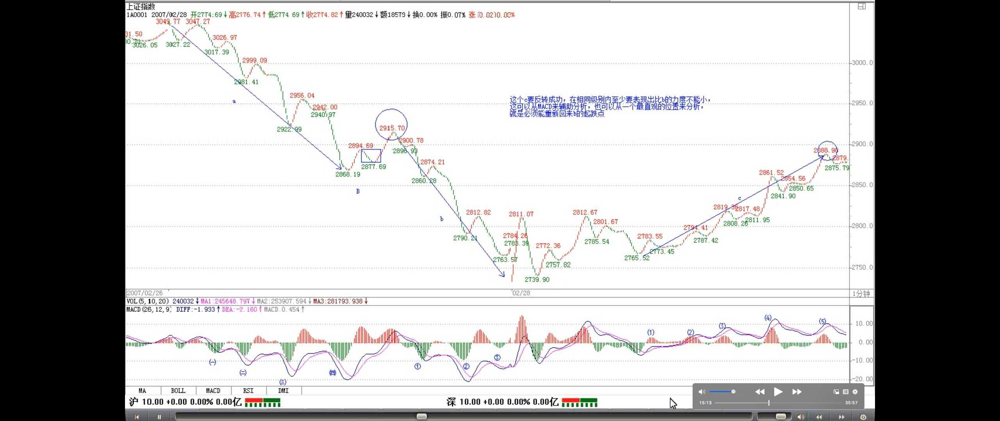
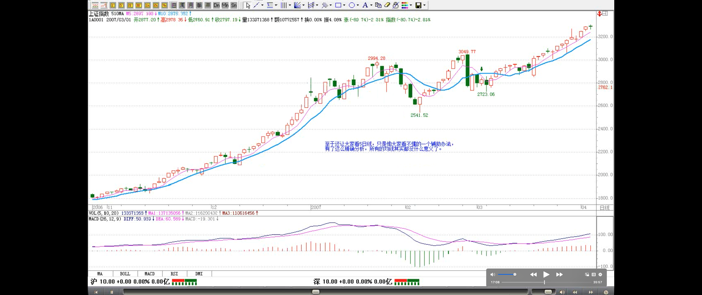
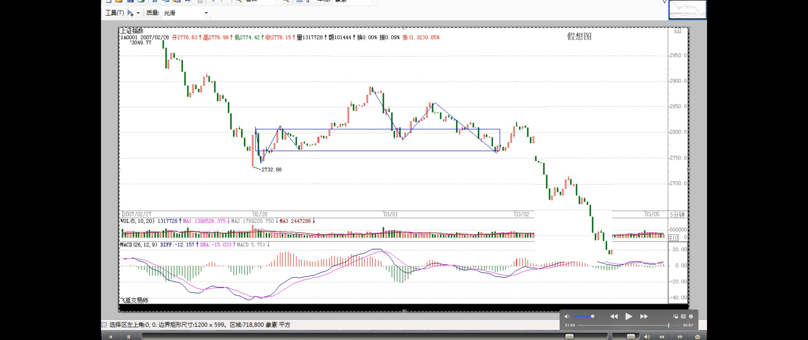

# 教你炒股票 33：走势的多义性

> 多义性（多意义性）的含义
>
> 所有走势的多义性，都与中枢有关

如果市场都是标准的 a+A+b+B+c，A、B 的中枢级别一样，那这市场也太标准、太不好玩了。**市场总有其复杂的地方，使得市场的走势呈现一种多义性**，就好象诗词中文字的多义性一样。如果没有**多意义性**，诗词都如逻辑一样，那也太没意思了。**而所有走势的多义性，都与中枢有关**。

> 多义性 1: 9 段中枢升级
>
> - 3 个一分钟走势类型，构成 1 个 5 分钟级别的中枢，即 1 个 5 分钟的盘整
> - 9 个一分钟走势类型，构成 3 个 5 分钟级别的中枢，即 3 个 5 分钟的盘整，即 1 个 30 分钟的中枢，即 30 分钟的盘整
>
> 中枢升级的第三种方式：9 段

例如，5 分钟级别的中枢不断延伸，出现 9 段以上的 1 分钟次级别走势。**站在 30 分钟级别的中枢角度，3 个 5 分钟级别的走势重合就形成了，而 9 段以上的 1 分钟次级别走势，每 3 段构成一个 5 分钟的中枢，这样也就可以解释成这是一个 30 分钟的中枢**。这种情况，只要对中枢延伸的数量进行限制，就可以消除多义性，一般来说，中枢的延伸不能超过 5 段，也就是**一旦出现 6 段的延伸，加上形成中枢本身那三段**，就**构成更大级别的中枢**了。

> 多义性 2：不同级别的图，模本（交易数据）的简略造成的
>
> **走势级别**
>
> - **含义：**
>   - 最严格的意义上说，从每笔成交递归出来各种级别
> - **级别与周期图的关系：**
>   - 级别跟 5 分钟、30 分钟、日线等，没有关系，只是在用这些周期图，查看不同级别的走势。
>   - 例如，用5分钟的周期k线图，查看‘5分钟’级别的走势
> - **查看级别的方法**：
>   - 你完全可以按照某个等比数列来弄一个级别序列
>   - 一些简单的变动也是可以接受的，例如去掉 30 分钟，换成 15 分钟和 60 分钟，形成 1 分钟、5 分钟、15 分钟、60 分钟、日线、周线、月线、季线、年线的级别安排，这也是可以的
> - **在小周期图看到的是什么？在大周期图看到的是什么？这两者有何区别？各自的优缺点？**
>   - 在小周期图中，能看到该周期级别和以上级别的走势，且看到的细节更多；
>       - 在1分钟周期图，看到的，有‘1分钟’级别、‘5分钟’级别、‘30分钟’级别、‘3小时/4小时’级别、‘日线’级别、‘周线’级别、‘月线’级别...都能看到。
>   - 在大周期图中，看不到该周期级别以下级别的走势，即看不到细节，但更方便看大级别；
>       - 在30分钟周期图，看不到‘1分钟’级别、‘5分钟’级别，只能看到‘30分钟’级别及以上的级别。
>   - 
>
> 如何查看不同级别的走势
>
> 使用 1 分钟、5 分钟、30 分钟、日线、周线、月线、季线、年线等的原因

**另外一种多义性，是因为模本的简略造成的**。**不同级别的图（注解：不同周期的图），其实就是对真实走势不同精度的一种模本**，例如，一个年线图当然没有 1 个分笔图的精确度高，**很多重要的细节都不可能在大级别的图里看到**。而所谓**走势的级别**，从最严格的意义上说，可以从每笔成交构成的最低级别图形不断按照中枢延伸、扩展等的定义精确地确认出来，这是最精确的，不涉及什么 5 分钟、30 分钟、日线等。**但这样会相当累，也没这个必要**。用 1 分钟、5 分钟、30 分钟、日线、周线、月线、季线、年线等的级别安排，**只是一个简略的方式，最主要是现在可以查到的走势图都是这样安排的**，当然，有些系统可以按不同的分钟数显示图形，例如，弄一个 7 分钟的走势图，这都完全可以。这样，**你完全可以按照某个等比数列来弄一个级别序列**。不过，可以是可以，但没必要。因为，**图的精确并没有太大的实质意义，真实的走势并不需要如此精确的观察**。当然，**一些简单的变动也是可以接受的，例如去掉 30 分钟，换成 15 分钟和 60 分钟**，形成 1 分钟、5 分钟、15 分钟、60 分钟、日线、周线、月线、季线、年线的级别安排，这也是可以的。

> **缠师的境界：走势的感觉**
>
> - 走势的感觉：
>
> - 中枢的意义：
>
> - 形成这种感觉的方法：
>
>   - 当你把分笔图或 1 分钟图不断缩小，这样，看到的走势越来越多，而这种从细部到全体的逐步呈现，会对走势级别的不断扩张有一个很直观的感觉，这种感觉，对你以后形成一种市场感觉是有点帮助的
>
> - 缠论入门标准：
>   - 说实在，当有了这种市场清晰的直觉，才算到门口了
>   - 只要那最细微的苗头一出来，就当下地领悟了，这才算是对市场走势这伟大诗篇一个有点合格的阅读。

虽然没有必要精确地从最低级别的图表逐步分析，但如果你看的图表的缩放功能比较好，当你把分笔图或 1 分钟图不断缩小，这样，看到的走势越来越多，而这种从细部到全体的逐步呈现，会对走势级别的不断扩张有一个很直观的感觉，**（归纳 🐢：走势的感觉：）_这种感觉，对你以后形成一种市场感觉是有点帮助的_**。**_在某个阶段，你可能会形成这样一种感觉，你如同站在重重叠叠的走势连绵中，而当下的趋向，仿佛照亮着层层叠叠的走势，（归纳 🐢：中枢的意义：）那时候，你往往可以忘记中枢之类的概念，所有的中枢，按照各自的级别，仿佛都变成大小不同的迷宫关口，而真正的路只有一条，而你的心直观当下地感应着。（归纳 🐢：缠论入门标准：）说实在，当有了这种市场清晰的直觉，才算到门口了。（归纳 🐢：中枢的意义：）那时候，就如同看一首诗，如果还从语法等去分析，就如同还用中枢等去分析一样，而真正的有感觉的读者，是不会计较于各种字句的纠缠的，整体的直观当下就呈现了，一首诗就如同一自足的世界，你当下就全部拥有了。市场上的直观，其实也是一样的。（归纳 🐢：缠论入门标准：）只要那最细微的苗头一出来，就当下地领悟了，这才算是对市场走势这伟大诗篇一个有点合格的的阅读。_**

> 多义性 3：走势分析中的多种合理释义---多角度对走势进行一个分析

**_在一名能充分直观的阅读者眼里，多义性是不存在的，而当这种最明锐的直觉还没出现时，对走势多义性的分析依然必要，因此也必须继续。换句话说，如果玩不了超逻辑的游戏，那只能继续在逻辑的圈子里晃悠_**。除了上面两种多义性，**还有一种有实质意义的多义性，也就是走势分析中的多种合理释义，这些释义都符合理论内在的逻辑，因此，这种多义性反而不是负担，而是可以用多角度对走势进行一个分析**。

> **中枢的含义（走势的一种观察角度）**
>
> 上面的例子
>
> 任何的走势图，其实就是一些级别大小不同的中枢
>
> 中枢的引力
>
> - 中枢向上力：上面的中枢产生向上的力
> - 中枢向下力：下面的中枢产生向下的力
> - 中枢合力：中枢向上力和中枢向下力的合力，市场已有走势构成的一个当下的力
>
> 当下买卖的力
>
> - 买是向上力
> - 卖是向下力
> - 当下买卖的合力：买向上力与卖向下力的合力，当下的交易产生的力

例如，对 a+A+b+B+c，**a 完全可以有另一种释义**，就是把 a 看成是围绕 A 这个中枢的一个波动，虽然 A 其实是后出现的，但不影响这种看法的意义。**同样 c 也可以看成是针对 B 的一个波动**，**这样整个走势其实就简化为两个中枢与连接两者的一个走势**。**在最极端的情况下**，在 a+A+b+B+c 的走势系列类型里，a 和 c 并不是必然存在的，而 b 完全可以是一个跳空缺口，这样，**整个走势就可以简化为两个孤零零的中枢**。**_把这种看法推广到所有的走势中，那么任何的走势图，其实就是一些级别大小不同的中枢，把这些看成不同的星球，在当下位置上的星球对当下位置产生向上的力，当下位置下的产生向下的力，而这些所有力的合力构成一个总的力量，而市场当下的力，也就是当下买卖产生的力，买的是向上的力，卖的是向下的力，这也构成一个合力，前一个合力是市场已有走势构成的一个当下的力，后者是当下的交易产生的力，而研究这两种力之间的关系，就构成了市场研究的另一个角度，也就是另一种释义的过程。这是一个复杂的问题，以后会陆续说到，算是高中的课程了。_**

> 中枢的引力
>
> 背驰的含义/定义
>
> 顶背驰、底背驰、盘整背驰
>
> 背驰、盘整背驰的异同

现在先别管什么力不力的，可以**从纯粹中枢的角度对背驰给出另外的释义**，对 a+A+b+B+c，**背驰的大概意思就是** c 段的力度比 b 的小了。那么，站在 B 这个中枢的角度，不妨先假设 b+B+c 是一个向上的过程，那么 b 可以看成是向下离开（注解：向上进入）中枢 B，而 c 可以看成是向上离开中枢 B。所谓**顶背驰**，就是最后这个中枢，向上离开比向下离开要弱。**而中枢有这样的特性，就是对无论向上或向下离开的，都有相同的回拉作用，既然向上离开比向下离开要弱，而向下离开都能拉回中枢，那向上的离开当然也能拉回中枢里**，对于 b+B+c 向上的走势，这就构成顶背驰，而对于 b+B+c 向下的走势，就构成**底背驰**。对于**盘整背驰**，这种分析也一样有效。其实，站在中枢的角度，**盘整背驰与背驰**，本质上是一样的，只是力度、级别以及发生的中枢位置不同而已。

> a+A+b+B+c，B 级别大于 A 的，**向下的** a+A+b 与 **向上的** c 的力度比较

同样，**站在纯中枢的角度，a+A+b+B，其中 B 级别大于 A 的这种情况就很简单了**，这时候，并不必然地 B 后面就接着原方向继续，而是可以进行反方向的运行。例如，a+A+b+B 是向下的，而 a+A+b 其实可以看成是对 B 一个向上离开的回拉，而对中枢来说，并没要求所有的离开都必须按照上下上下的次序，一次向上的离开后再一次向上的离开，完全是被允许的，那站在这个角度，从 B 直接反转向上，就是很自然的。那么，这个反转是否成功，不妨把这个后续的反转写成 c，那么也只要比较一下 a+A+b 与 c 这两段的力度就可以，因为中枢 B 对这两段的回拉力度是一样的，如果 c 比 a+A+b 弱，那当然反转不成功，也就意味着一定要重新回到中枢里，在最强的情况下也至少有一次回拉去确认能否构成一个第三类买点。**而 a+A+b 与 c 的力度比较，与背驰的情况没什么分别，只是两者的方向不同而已。** 如果用 MACD 来辅助判别，背驰比较的黄白线和柱子面积都在 0 轴的一个方向上，例如都在上面或下面，而 a+A+b 与 c 就分别在不同的方向上，由于这，也不存在黄白线回拉的问题，但有一点是肯定的，就是黄白线至少要穿越一次 0 轴。这几天大盘的走势，就对这种情况有一个最标准的演示。简略分析一下。

> **观察走势力度的两种方法：**
>
> - MACD 辅助分析
> - 价格区间：力度大的，价格区间大。这就如同向天上抛球，力度大的如果还抛不高，那怎么能算力度大？

由于相应的 a+A+b 是一个 1 分钟的走势，那天故意提早开盘前发帖子，等于是现场直播 B 的形成，但 1 分钟的走势，估计能看到或保留的不多，那就用 15 分钟图来代替。02270945 到 02280945，刚好 4 小时，构成 a+A+b，其中的 A，在 15 分钟图上看不清楚，在 1 分钟图上是 02271306 到 02271337，中枢的区间是 2877 到 2894 点，中枢波动的高点也就是 b 的起跌点是 2915 点。**c 段大致从 02281100 算起，这个 c 要反转成功，在相同级别内至少要表现出比 b 的力度不能小，这可以从 MACD 来辅助分析，也可以从一个最直观的位置来分析，就是必须能重新回来 b 的起跌点，这就如同向天上抛球，力度大的如果还抛不高，那怎么能算力度大**？至于 c 能不能回到 b 的起跌点，那可以分析 c 内部的小级别，如果 c 出现顶背驰时还达不到该位置，那自然达不到了，所以这种分析都是当下的，不需要预测什么。有人问为什么要看 2915 点，道理就是这个。至于还让大家看 5 日线，只是怕大家看不懂的一个辅助办法，有了这么精确分析，所有的均线其实都没什么意义了。而 c 的力度不够，那就自然要回到 B 里，所以后面的走势就是极为自然的。站在这个角度，2888 点的第一卖点没走，那么 03011100 的 2859 点也该走了，那也可以看成是对 B 的再次离开，这力度显然更小，当然要走了等回跌以后看情况再回补，而后面又出现了 100 点的回跌，然后出现底背驰，当然就是一个完美的回补点了。

> **围绕中枢的操作原则**

**总体围绕中枢的操作原则很简单，每次向下离开中枢只要出现底背驰，那就可以介入了，然后看相应回拉出现顶背驰的位置是否能超越前面一个向上离开的顶背驰高点，不行一定要走，行也可以走，但次级别回抽一旦不重新回到中枢里，就意味着第三类买点出现了，就一定要买回来**。而如果从底背驰开始的次级别回拉不能重新回到中枢里，那就意味着第三类卖点出现，必须走，然后等待下面去形成新的中枢来重复类似过程。围绕中枢的操作，其实就这么简单。当然，没有本 ID 的理论，是不可能有如此精确的分析的，就像没有牛顿的理论，人们只能用神话去讲述一切关于星星的故事。

不过，这些分析都是针对指数的，而个股的情况必须具体分析，很多个股，只要指数不单边下跌，就会活跃，不爱搭理指数，所以不能完全按指数来弄。其实。对于指数，最大的利益在期货里。不过，期货的情况有很大的特殊性，因为期货是可以随时开仓的，和股票交易凭证数量的基本稳定不同，所以在力度分析等方面有很多不同的地方，这在以后再说了。
