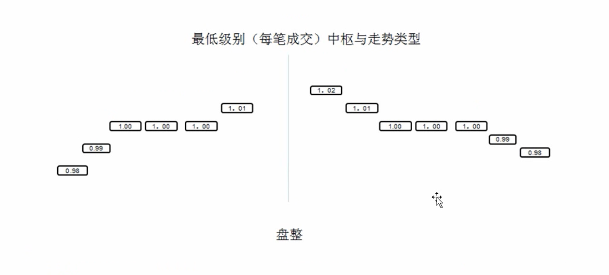
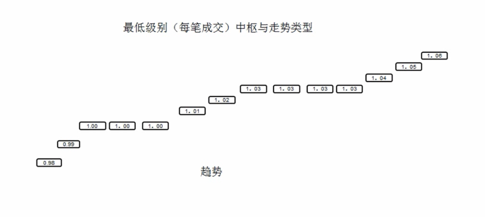
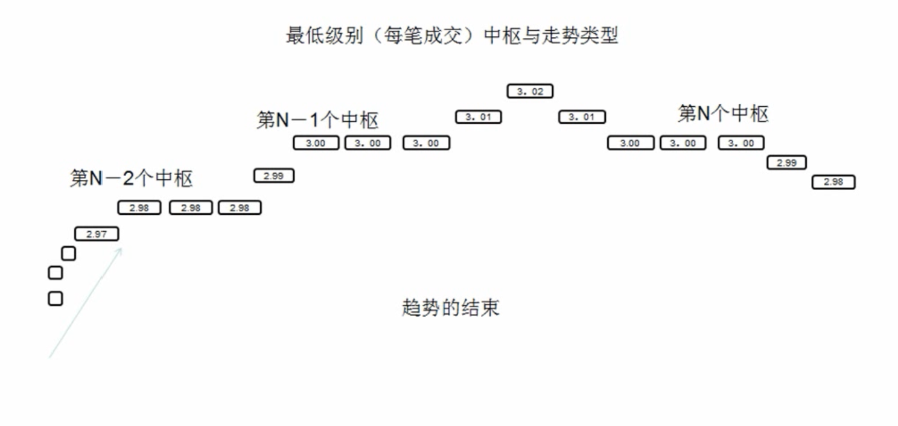
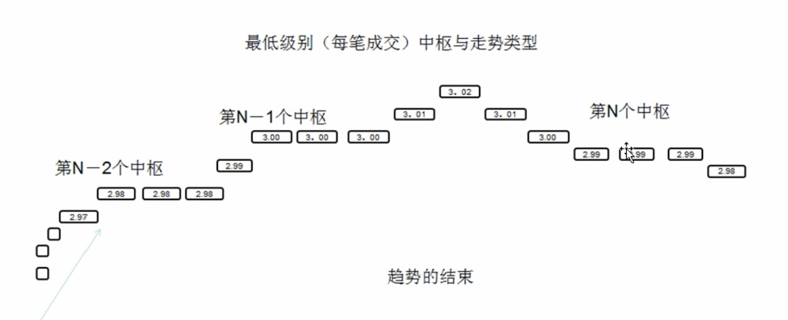
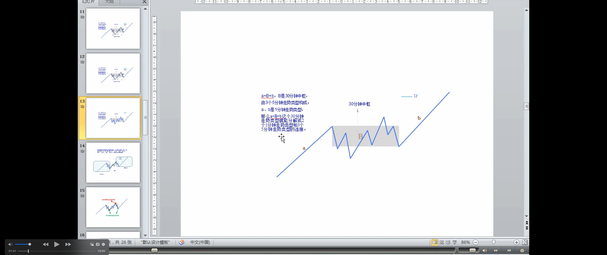

# 教你炒股票 35：给基础差的同学补补课
(2007-03-09 11:51:34)

下午，那媒体要开组建筹划会，本 ID 必须参加，先把帖子放上来。大盘走势昨天已提示“现在依然存在重新跌回这 5 分钟中枢，从而扩展成新的 30 分钟中枢的可能，所以 2915 是不能有效跌破的，否则将扩展出新的 30 分钟中枢”。早上一典型的 5 分钟顶背驰让这情况变得天经地义。昨天第三类买点后，理论上两种可能之一就是演化成大级别中枢，今天就是一经典演示。该中枢从 7 日 13 点多的 2911 算起，形成后，和前几天下面那 30 分钟中枢操作一样，市场又给一次相同类型的操作机会。不多说，最近很忙，对大家照顾不周，抱歉了。

> 前面课程，最基础的无非两方面，一、中枢；二、走势类型及其连接
>
> - 这两方面相互依存
>
> 级别的作用
>
> - 要解决该循环，级别的概念是不可缺少的
> - 有了级别，一个严格的递归式定义才可以展开

个人的理解能力之间相差太大，自然就有先后之别，因此用一堂课给基础差的同学补补课也是应该的，而且很多自以为基础好、明白的，看看也有益，有些细微处的理解也不一定能完全到位。**前面课程，最基础的无非两方面，一、中枢；二、走势类型及其连接**。**这两方面相互依存**，如果没有走势类型，中枢也无法定义；而没有中枢，走势也无法分出类型。如果理论就此打住，那么一个循环定义就不可避免。**要解决该循环**，级别的概念是不可缺少的。**有了级别，一个严格的递归式定义才可以展开。**

> 最低级别(v2.0)
>
> 最低级别的中枢、最低级别的盘整走势类型、最低级别的趋势走势类型、最低级别的上涨结束

所谓的**最低级别**，就如量子力学的量子概念，物理世界不是想当然地无限连续的，而市场的交易同样如此。最严格去定义，每笔的交易是最低级别的，连续三笔相同价位的交易，就构成**最低级别的中枢**。有一个最低级别中枢的走势，就是**最低级别的盘整走势类型**；有两个最低级别中枢的走势，就是**最低级别的趋势走势类型**，如果第二个中枢比第一个高，那就是上涨走势类型，反之就是下跌走势类型。一般来说，假设依次存在着 N（N>2）个中枢，只要依次保持着第 N 个中枢比 N-1 个高的状态，那么就是**上涨走势类型的延续**；依次保持着第 N 个中枢比 N-1 个低的状态，就是**下跌走势类型的延续**。显然，根据上面的定义，在最低级别的上涨里，只要也只有出现依次第 N 个中枢不再高于、即等于或低于第 N-1 个的状态，才可说这**最低级别的上涨结束**。最低级别下跌的情况与此相反。

> **递归**
>
> - 如何从最低级别逐级递归
>
> - 按照严格的定义操作
>
>   - 太麻烦也没多大意义
>
> - 方便的不严格的操作
>   - 方便，但不严格，不会产生任何原则性的问题
>
> 周期图与级别的关系
>
> - 使用这些不同的周期图，来方便地查看不同的级别

上面就用最低级别的中枢把走势在最低级别上进行了完全分类，而三个连续的最低级别走势类型之间，如果发生重叠关系，也就是三个最低级别走势类型所分别经过的**价格区间有交集**，那么就**形成了高一级别的缠中说禅中枢**。有了该中枢定义，依照在最低级别上的分类方法，同样在高级别上可以把走势进行完全的分类，**而这个过程可以逐级上推，然后就可以严格定义各级别的中枢与走势类型而不涉及任何循环定义的问题**。但如果**按严格定义操作**，必须从最低级别开始逐步确认其级别，太麻烦也没多大意义，所以才有了后面 1、5、15、30、60 分钟，日、周、月、季、年的级别分类。**在这种情况下，就可以不大严格地说，三个连续 1 分钟走势类型的重叠构成 5 分钟的中枢，三个连续 5 分钟走势类型的 重叠构成 15 或 30 分钟的中枢**等话。在实际操作上，这种不大严格的说法**不会产生任何原则性的问题，而且很方便**，所以就用了，对此，必须再次明确。

> 中枢的级别和走势类型的级别的关系：走势类型的级别由它的中枢级别确定

以上这些，都在前面反复提到，但很多人好象还是糊涂，不妨最后再说一次。**显然，站在任意一个固定级别里，走势类型是可以被严格划分的**。例如，说**一个 5 分钟的走势类型，显然不可能包含一个 30 分钟的中枢**，因为按定义，一个单独的 5 分钟走势类型无论如何延续，也不可能出现一个 30 分钟的中枢。要形成一个 30 分钟的中枢，显然只能是 3 个以上 5 分钟走势类型的连接才可能。走势类型与走势类型的连接，这两个概念不可能有任何含糊的地方。5 分钟走势类型，必须包含也最多包含 5 分钟级别中枢，至于是 1 个还是 5 个，都不影响是 5 分钟走势类型，只不过可被分类成是 5 分钟级别的盘整类型还是趋势类型而已。

> 一个高级别的走势类型必然就是由几个低级别的走势类型连接而成，**但不一定都是次级别的走势类型（可以是次次级别或跳空缺口）**
>
> 但我们还可以通过拆散重分，使得一个高级别的走势类型必然就是由几个次级别的走势类型连接而成
>
> 走势分解定理二

**显然，一个高级别的走势类型必然就是由几个低级别的走势类型连接而成，但不一定都是次级别的走势类型**，例如，a+B+b，B 是 30 分钟中枢，由 3 个 5 分钟走势类型构成，a、b 是 1 分钟走势类型，那么 a+B+b 这个 30 分钟走势类型就能分解成 2 个 1 分钟走势类型和 3 个 5 分钟走势类型的连接。**但我们还可以通过拆散重分，使得一个高级别的走势类型必然就是由几个次级别的走势类型连接而成**，由于中枢里至少有三段次级别走势类型，所以就有了 “**缠中说禅走势分解定理二**“：任何级别的任何走势类型，都至少由三段以上次级别走势类型构成。

> 走势类型连接这种运算是符合**结合律**的
>
> - 拆分，重新组合
>
> 走势类型连接运算
>
> 走势分解定理一

例如，还是上面 a+B+b 的例子，估计很多人怎么都看不出为什么这分解定理一定成立。其实，不妨假设 B 中有三段 5 分钟走势类型，分别表示为 B1、B2、B3，那么 **a+B+b=a+ B1+B2+B3+b=（ a+ B1）+B2+（B3+b）**，**显然（ a+ B1）、B2、（B3+b）都是 5 分钟走势类型，这就是该分解定理所说的东西**。学过一点抽象代数的都容易理解上面的话，用抽象的话说，就是**走势类型连接这种运算是符合结合律的**。但走势类型的连接运算不符合交换率，这就是该运算的特别之处。**只要明白了走势类型连接运算的结合性，那就不难同时明白 “缠中说禅走势分解定理一”**：任何级别的任何走势，都可以分解成同级别“盘整”、“下跌”与“上涨”三种走势类型的连接。

其实，就像量子力学有多种数学的处理形式，**本 ID 的理论，同样可以用抽象代数的方法来处理**，只是那样的话，就更少人能看懂了。而抽象的方法，不仅简洁，而且更能暴露其实质。这些以后再说了，**现在还是用比较简单的、类似几何的方法去理解吧**。

> **级别的含义**
> - 走势是客观的，而用什么级别去分析这走势却是主观的
> - 确定自己操作的级别，就是确定自己究竟是按什么级别来分析、操作
>   - 例子

**注意，走势是客观的，而用什么级别去分析这走势却是主观的**。根据“缠中说禅走势分解定理一”，任何级别的任何走势，都可以分解成同级别“盘整”、“下跌”与“上涨”三种走势类型的连接，**那么就意味着，按某种级别去操作，就等于永远只处理三种同一级别的走势类型及其连接**。还是上面 a+B+b 的例子，站在 5 分钟级别的角度，这里有三个走势类型的连接，站在 30 分钟级别的角度，就只有一个走势类型。那么，前面反复说的，**确定自己操作的级别，就是确定自己究竟是按什么级别来分析、操作**。**例如**，5 分钟级别上下上三段（注解🐷：这应该是1分钟级别走势类型），意味着在 5 分钟级别上有 2 个底背驰、2 个顶背驰，按买点买、卖点卖的原则，就有 2 次的完整操作（疑问🤔️：这里应该是5分钟盘整时的操作吧？）；而按 30 分钟级别看，这里就没有买卖点，所以就无须操作。

> **小级别的优缺点：**
> - 优点：操作级别越低，相应的效率越高；
> - 缺点：平均的买卖点间波幅也越小，不足以让交易成本、交易误差等相对买卖点间波幅足够小，这样的操作，从长期的角度看，是没有意义的。
> 
> 交易误差

**从纯理论的角度，操作级别越低，相应的效率越高（注解🐷：缠师也说过，对于新手，失误的次数也会越多），但实际操作级别是不可能随意低的，而究竟按什么级别来分析、操作，和你的资金等具体条件相关**。例如，T+1 的情况下，按 1 分钟以下级别的操作，就面临着不能顺利兑现的风险，而系统的操作，要把所有可能的情况都考虑其中，因此完全按 1 分钟以下级别的操作是不可能的，除非是 T+0。**此外，级别越小，平均的买卖点间波幅也越小，因此，那些太小的级别，不足以让交易成本、交易误差等相对买卖点间波幅足够小，这样的操作，从长期的角度看，是没有意义的**。所谓的**交易误差**，可以包括很多，例如你看见买点到你实际操作完成，必然有一个时间差，因此也就有了价位上的差别，这对于大级别无所谓，但对特小级别，那就需要特别精确，而这是不可能长期达到的。

> 定好级别后，该如何做
> 
> **操作的立体性：** 
>   - 该级别出现买卖点，该级别的1、2、3类买卖点；
>   - 该级别盘整时，参与次级别的买卖点；

因此，根据各种情况，你就可以相应定好自己的操作级别，这样就可以按照相应的级别分析、操作。**也就是说，一旦该级别出现买卖点，你必须进入或退出。也就是说，在你的操作级别上，你是不参与任何调整或下跌走势类型的**。有人曾问**本 ID 为什么 2001 年后四年都不看股票**，那很简单，就因为在本 ID 的操作级别上出现卖点，所以就全部退出，等有相应买点再说。**制定了相应级别，是否按照次级别以下进行部分操作，那是操作风格问题，而实际上是应该安排这种操作的，特别当进入一个你的操作级别的次级别盘整或下跌，这是你可以忍受的最大级别非上涨走势，当然要操作一下来降低自己的成本**。如果你的操作级别很大，那么其次级别的次级别，也可以用来部分操作的。这样，**整个操作就有一定的立体性**，从而更降低其风险，也就是能进行把成本降低这唯一能降低风险的活动，只有当成本为 0 时，才算真正脱离风险。

> 缠中说禅买卖点级别定理

根据“缠中说禅走势分解定理”，很容易就证明“**缠中说禅买卖点级别定理**”：大级别的买卖点必然是次级别以下某一级别的买卖点。

这个证明很简单，具体就不写了，还用上面的例子来说明：a+B+b=a+ B1+B2+B3+b=（ a+ B1）+B2+（B3+b），最后的（B3+b）形成 30 分钟的买卖点，那么自然其极限点在 b 上，对 b 进行分解，如果该极限点不是 b 的买卖点，那么就意味着 b 还没完成，还要延伸下去，那么这极限点自然也不会是（B3+b）的极限点，这就矛盾了。但注意，大级别的买卖点不一定就是次级别的买卖点，在这个例子里，b 可以是 1 分钟级别的，就不是 30 分钟级别的次级别了。所以只能说是次级别以下某一级别的买卖点。**这也是为什么有时候，有时候一个 1 分钟的背驰就会引发大级别下跌的原因**。在最规范的走势中，该大级别的买卖点刚好是下面所有级别的买卖点。当然，这还是一个很粗糙的定理，在以后的课程里，还有更精细的，这以后再说了。
