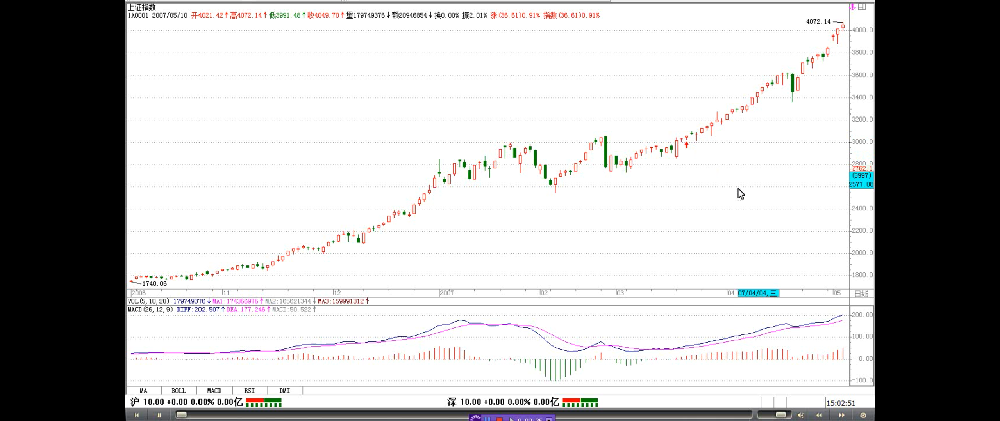
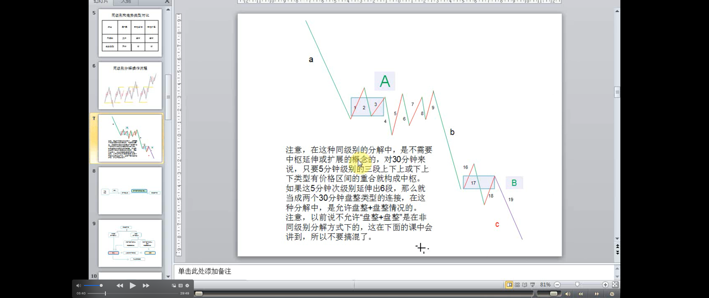
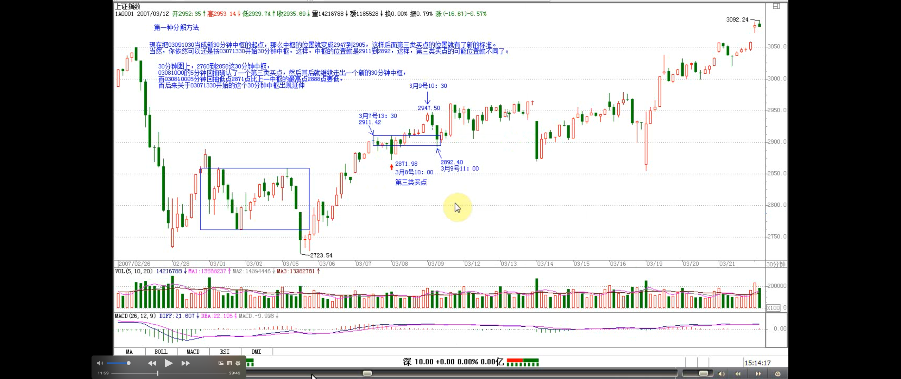
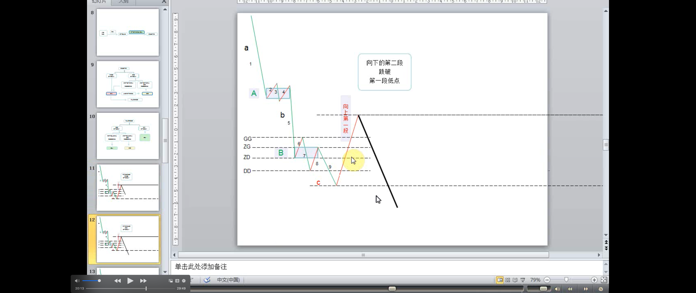
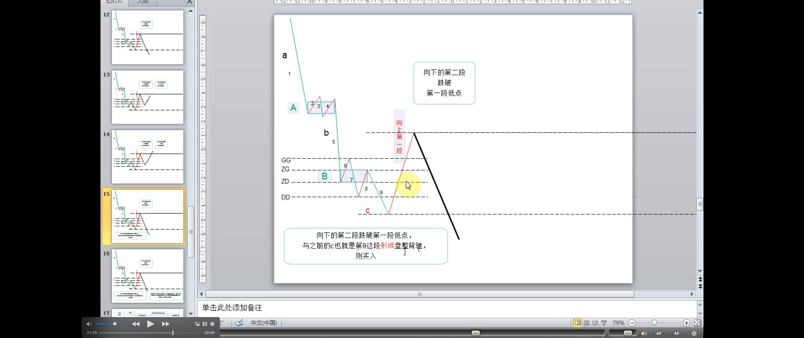
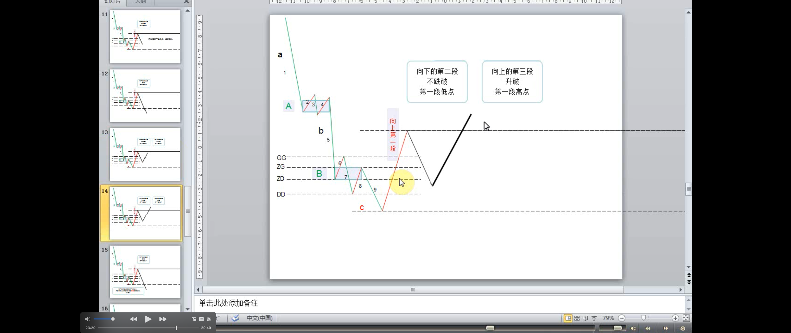
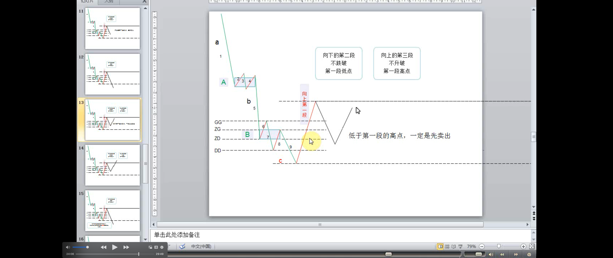
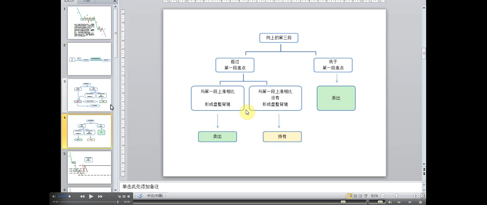

# 教你炒股票 38：走势类型连接的同级别分解

站在纯操作的角度，由于任何买卖点，归根结底都是某级别的第一类买卖点，**因此，只要搞清楚如何判断背驰，然后选好适合的级别，当该级别出现底背驰时买入，顶背驰时卖出，就一招鲜也足以在市场上混好了**。不过，任何事情都应该究底穷源，这有点像练短跑，跑到最后，提高 0.01 秒都很难，**所以越往后，难度和复杂程度都会越来越深，如果一时啃不下来，就选择可以把握的，先按明白的选择好操作模式，等市场经验多了，发现更多需要解决的问题，有了直观感觉，再回头看，也不失为一种学习的办法。当然，都能看懂并能马上实践，那最好。**

> 多义性的误解
>
> 多义性是与走势的当下性密切相关的
>
> 根据结合律，如何选择一种恰当的走势分解，对把握当下的走势极为关键
>
> 同级别分解

前面谈了有关走势类型连接结合的多义性问题，**虽然已多次强调多义性不是含糊性，但不少人依然产生误解，认为走势就可以胡乱分解了，这是不对的**。**多义性是与走势的当下性密切相关的**，但对已完成走势类型连接进行相应的分解，就如同解问题设定不同的参数，虽然参数的设定有一定的随意性，但一个好的参数设定，往往使得问题的解决变得简单。**根据结合律，如何选择一种恰当的走势分解，对把握当下的走势极为关键**。显然，一个好的分解，其分解规则下，必须保证分解的唯一性，否则这种分解就绝对不可能是好的分解。其中，最简单的就是进行同级别分解。所谓**同级别分解**，就是把所有走势按一固定级别的走势类型进行分解。根据“缠中说禅走势分解定理”，同级别分解具有唯一性，不存在任何含糊乱分解的可能。

> 在这种同级别的分解中，是不需要中枢延伸或扩展的概念的

**同级别分解的应用**，前面已多有论述，例如，以 30 分钟级别为操作标准的，就可用 30 分钟级别的分解进行操作，对任何图形，都分解成一段段 30 分钟走势类型的连接，操作中只选择其中的上涨和盘整类型，而避开所有下跌类型。**对于这种同级别分解视角下的操作，永远只针对一个正在完成着的同级别中枢，一旦该中枢完成，就继续关注下一个同级别中枢**。注意，**在这种同级别的分解中，是不需要中枢延伸或扩展的概念的**，对 30 分钟来说，只要 5 分钟级别的三段上下上或下上下类型有价格区间的重合就构成中枢。**如果这 5 分钟次级别延伸出 6 段，那么就当成两个 30 分钟盘整类型的连接**，在这种分解中，是允许盘整+盘整情况的。注意，以前说不允许“盘整+盘整”是在非同级别分解方式下的，这在下面的课中会讲到，所以不要搞混了。

有人可能马上要问，同级别分解的次级别分解是否也是同级别分解的。答案是，不需要。这里在思维上可能很难转过弯，因为一般人都喜欢把一个原则在各级别中统一运用，但实际上，你完全可以采取这样的分解形式，就是只要某级别中进行同级别分解，而继续用中枢扩展、延伸等确定其次级别，这里只涉及一个组合规则的问题，而组合的规则，是为了方便操作以及判断，只要不违反连接的结合律以及分解的唯一性，就是允许的，而问题的关键在于是否明晰且易于操作。

说得深入一点，**走势分解、组合的难点在于走势有级别**，而高级别的走势是由低级别构成的，**处理走势有两种最基本的方法**，一种是**纯粹按中枢来**，一种是**纯粹按走势类型来**，**但更有效的是在不同级别中组合运用**。因此，完全合理、不违反任何理论原则的，**可以制定出这样的同级别分解规则**：在某级别中，不定义中枢延伸，允许该级别上的盘整+盘整连接；与此同时，**规定该级别以下的所有级别**，都允许中枢延伸，不允许盘整+盘整连接；**至于该级别以上级别**，根本不考虑，因为所有走势都按该级别给分解了。

按照以上的同级别分解规则，用结合律很容易证明，这种分解下，其分解也是唯一的。**这种分解，对于一种机械化操作十分有利。这里，无所谓牛市熊市**，例如，如果分解的级别规定是 30 分钟，那么只要 30 分钟上涨就是牛市，否则就是熊市，完全可以不管市场的实际走势如何，在这种分解的视角下，市场被有效地肢解成一段段 30 分钟走势类型的连接，如此分解，如此操作，如此而已。

注意，这种方法或分解是可以结合在更大的操作系统里的。例如，**你的资金有一定规模，那么你可以设定某个量的筹码按某个级别的分解操作，另一个量的筹码按另一个更大级别的分解操作**，这样，就如同开了一个分区卷钱的机械，机械地按照一个规定的节奏去吸市场的血。这样不断地机械操作下去，成本就会不断减少，而这种机械化操作的力量是很大的。

**其实，根本无须关心个股的具体涨幅有多少，只要足够活跃，上下震荡大，这种机械化操作产生的利润是与时间成正比的，只要时间足够长，就会比任何单边上涨的股票产生更大的利润**。甚至可以对所有股票按某级别走势的幅度进行数据分析，把所有历史走势都计算一次，选择一组历史上某级别平均震荡幅度最大的股票，不断操作下去，这样的效果更好。这种分解方法，特别适合于小资金又时间充裕的进行全仓操作，也适合于大资金进行一定量的差价操作，更适合于庄家的洗盘减成本操作。当然，每种在具体应用时，方法都有所不同，但道理是一样的。

**具体的操作程式，按最一般的情况列举如下，注意，这是一个机械化操作，按程式来就行**：不妨从一个下跌背驰开始，以一个 30 分钟级别的分解为例子，按 30 分钟级别的同级别分解，必然首先出现向上的第一段走势类型，根据其内部结构可以判断其背驰或盘整背驰结束点，先卖出，然后必然有向下的第二段，这里有两种情况：1、不跌破第一段低点，重新买入，2、跌破第一段低点，如果与第一段前的向下段形成盘整背驰，也重新买入，否则继续观望，直到出现新的下跌背驰。在第二段重新买入的情况下，然后出现向上的第三段，相应面临两种情况：1、超过第一段的高点；2、低于第一段的高点。对于第二种情况，一定是先卖出；第一种情况，又分两种情况：1、第三段对第一段发生盘整背驰，这时要卖出；2、第三段对第一段不发生盘整背驰，这时候继续持有。这个过程可以不断延续下去，直到下一段向上的 30 分钟走势类型相对前一段向上的走势类型出现不创新高或者盘整背驰为止，这就结束了向上段的运作。向上段的运作，都是先买后卖的。一旦向上段的运作结束后，就进入向下段的运作。向下段的运作刚好相反，是先卖后买，从刚才向上段结束的背驰点开始，所有操作刚好反过来就可以。

